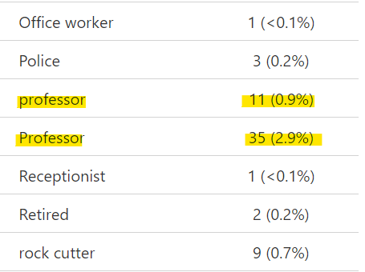

```{r, echo = F, message = F, warning = F}
# Load packages 
if(!require(pacman)) install.packages("pacman")
pacman::p_load(rlang, tidyverse, knitr, here, reactable, gt, flextable, kable)

## functions
source(here::here("global/functions/misc_functions.R"))

## default render
registerS3method("reactable_5_rows", "data.frame", reactable_5_rows)
knitr::opts_chunk$set(class.source = "tgc-code-block")
```

------------------------------------------------------------------------

# Introduction

{width="145"}

Data cleaning is the process of transforming raw, "messy" data into reliable data that can be properly analyzed. This entails identifying **inaccurate**, **incomplete**, or **improbable** data points, and resolving data inconsistencies or errors, as well as renaming variable names to make them more clear and simple to manipulate.

Data cleaning tasks can often be tedious and time-consuming. A common joke among data analysts goes "80% of data science is cleaning the data and the remaining 20% is complaining about cleaning the data." But data cleaning is an essential step of the data analysis process. A little bit of cleaning at the start of the data analysis process will go a long way to improving the quality of your analyses and the ease with which these analyses can be done. And a range of packages and functions in R can significantly simplify the data cleaning process.

In this lesson, we will begin to look at a typical data cleaning pipeline in R. The cleaning steps covered here are unlikely to be exactly what is needed for your own datasets, but they will certainly be a good starting point.

Let's get started!

------------------------------------------------------------------------

# Learning objectives

-   You can diagnose dataset issues that warrant data cleaning through functions such as:

    -   `visdat::vis_dat()`

    -   `inspectdf::inspect_cat()`

    -   `inspectdf::inspect_num()`

    -   `gtsummary::tbl_summary()`

------------------------------------------------------------------------

# Packages

The packages loaded below will be required for this lesson:

```{r}
if(!require("pacman")) install.packages("pacman")
pacman::p_load(visdat, 
               inspectdf,
               gtsummary,
               tidyverse)
```

------------------------------------------------------------------------

# Dataset

The primary dataset we will use in this lesson is from a study conducted in three healthcare centres in Zambezia, Mozambique. The study investigated individual factors associated with time to non-adherence to HIV care and treatment services. For the sake of this lesson, we will only be looking at a modified subset of the full dataset.

The full dataset can be obtained from [Zenodo](https://zenodo.org/records/4965547), and the paper can be viewed [here](https://www.ncbi.nlm.nih.gov/pmc/articles/PMC6433271/).

Let's take a look at this dataset:

```{r message=FALSE}
non_adherence <- read_csv(here("data/non_adherence_moz.csv"))
```

```{r render = reactable_5_rows}
non_adherence
```

The first step of data cleaning will be to explore this dataset in order to identify potential issues that warrant cleaning. This preliminary step is sometimes called "exploratory data analysis" or EDA.

Let's take a look at a few simple EDA commands in R that will help you identify possible data errors and inconsistencies.

------------------------------------------------------------------------

# Visualizing missing data with `visdat::vis_dat()`

The `vis_dat()` function from the `visdat` package is a wonderful way to quickly visualize data types and missing values in a dataset. It creates a plot that shows a "zoomed out" spreadsheet view of your data frame: each row in the dataframe is represented by a single line on the plot.

Let's try it out with small mock dataset first to get an idea of how it works. Copy the following code to create a dataframe of 8 patients and their COVID-19 diagnosis and recovery information. As you can see below, some patients have missing information, represented as `NA`.

```{r render=reactable_10_rows}
covid_pat <- tribble(
  ~Patient_ID, ~Age, ~Gender,  ~Covid_Strain, ~Exposure,    ~Recovery_Days,
  1,           25,   "Male",   "Alpha",        NA,          10,
  2,           32,   "Female", "Delta",       "Hospital",   15,
  3,           45,   "Male",   "Beta",        "Travel",      7,
  4,           19,   "Female", "Omicron",      NA,          21,
  5,           38,   "Male",   "Alpha",       "Unknown",    14,
  6,           55,   "Female",  NA,           "Community",  19,
  7,           28,   "Female", "Omicron",      NA,           8,
  8,           NA,   "Female", "Omicron",     "Travel",     26
)
covid_pat
```

Now, let's use the function `vis_dat()` on our dataframe to get visual representation of the data types and missing values.

```{r dpi = 350}
vis_dat(covid_pat)
```

That looks great! Each row in our dataframe is represented by a single line in the plot and different colours are used to illustrate the character (pink) and numeric (blue) variables, as well as missing values (grey). From this plot, we can tell that quite a few patients in our dataset are missing data for the `Exposure` variable.

Now let's turn back to our real-world dataset which is much larger and messier. Large real-world datasets may exhibit intricate patterns in the data that are difficult to spot without visualization, so using functions such as `vis_dat()` can be particularly useful. Let's try it out now!

```{r dpi = 350}
vis_dat(non_adherence)
```

Great! From this view we can already see some problems:

-   there seems to be a completely empty column in the data (the column `NA` which is fully gray)
-   several variables have a lot of missing values (such as `Education`, `BMI_Initation_Art`, and `CD4_Initation_ART`)
-   the names of some variables are unclear/unclean (e.g., `Age at ART initation` and `WHO status at ART initiaion` have whitespaces in their names and `Civil...status` and `regimen.1` have special characters, `.`)

In the next lesson, we will try to remedy these and other issues as best as possible during the data cleaning process. But for now, the goal is that we understand the functions used to identify them. So now that we have a solid grasp on how to visualize missing data with `vis_dat()`, let's take a look at another package and function that can help us generate summary statistics of our variables!

::: r-practice
### Spotting data issues with `vis_dat()`

*(NOTE: Answers are at the bottom of the page. Try to answer the questions yourself before checking.)*

The following dataset was adapted from a study that investigated missed opportunities for HIV testing among patients newly presenting for HIV care at a Swiss university hospital. The full dataset can be found [here](https://zenodo.org/records/5008340).

```{r echo=FALSE}
missed_ops <- read_csv(here("data/HIV_missed_ops.csv"))
```

Use the `vis_dat()` function to get a visual representation of the data. What potential issues can you spot based on the output?
:::

------------------------------------------------------------------------

# Visualizing variable distributions with functions from `inspectdf`

You may sometimes want to generate quick graphical summaries of your variable distributions. For this, the functions `inspectdf::inspect_cat()` and `inspectdf::inspect_num()` can be used.

If you run `inspect_cat()` on a data object, you get a tabular summary of the categorical variables in the dataset (the important information is hidden in the `levels` column). Let's try it out on the `covid_pat` dataset first. As a reminder, here is our dataset:

```{r render=reactable_10_rows}
covid_pat
```

```{r render=reactable_5_rows}
inspect_cat(covid_pat)
```

The magic happens when you run `show_plot()` on the result from `inspect_cat()`:

```{r}
inspect_cat(covid_pat) %>% 
  show_plot()
```

That looks great! You get a nice summary figure showing the distribution of categorical variables! Variable levels are also nicely labelled (if there is sufficient space to show a label).

Now, let's try it out on our `non_adherence` dataset:

```{r}
inspect_cat(non_adherence) %>% 
  show_plot()
```

From here you can observe some issues with a few categorical variables:

-   The variable level `Under 35` is capitalized, whereas `over 35` is not. It could be worth standardizing this.
-   The variable sex has the levels `F` and `Male`. This too could be worth standardizing.
-   As we have previously seen, `NA` is completely empty

::: r-practice
### Spotting data issues with `inspect_cat()` {.unlisted .unnumbered}

Complete the following code to obtain a visual summary of the categorical variables in the `missed_op` dataset.

```{r, eval=FALSE}
inspect___() %>% 
  __________
```

How many potential data issues can you spot?
:::

Similarly, you can obtain a summary plot for the numerical variables in the dataset with `inspect_num()`. Let's run this on our `non_adherence` dataset:

```{r}
inspect_num(non_adherence) %>% 
  show_plot()
```

From this output, you can notice that many variables which should be factor variables are coded as numeric. In fact, the only true numeric variables are `Age at ART initiation`, `BMI_Initiation_ART`, `CD4_Initation_ART`, and `Nr_of_pills_day`. We will fix these issues in the next lesson when we move on to data cleaning. For now though, let's take a look at our another function that's particularly helpful for categorical varibales!

::: r-practice
### Variable types with `inspect_num()` {.unlisted .unnumbered}

Use `inspect_num` to create a histograms of your numeric variables in the `missed_op` dataset. Are the numeric variable types correct?
:::

------------------------------------------------------------------------

# Exploring categorical variable levels with `gtsummary::tbl_summary()`

While the `inspect_cat()` function is useful for a graphical overview of categorical variables, it doesn't provide frequency counts or percentages for the various levels. For this, the `tbl_summary()` from the `gtsummary` package is particularly helpful! The output is particularly long so we'll look at the tibble form and show a photo of the important part for our dataset. You can explore the whole output as you code along at home.

Let's try it out on our `non_adherence` dataset:

```{r}
gtsummary::tbl_summary(non_adherence) 
```

That looks great! As we can see it outputs a summary of the frequency and percentages for categorical variables and the median and IQR for numeric variables.

Below is a photo of part of the output where we can see additional issues with our data that wasn't clear using the `inspect_cat()` function. Some values from our `Occupation` variable are capitalized, whereas others are all in lower case.



This means that R doesn't recognize them as being the same value which would be problematic during analysis. We'll fix these errors in the next lesson!

::: r-practice
### Spotting data issues with `tbl_summary()` {.unlisted .unnumbered}

Use `tbl_summary()` to output a summary of your `missed_ops` dataset. Can you identify any additional data issues?
:::

------------------------------------------------------------------------

# Wrap up!

By familiarizing ourselves with the data, we have been able to identify some potential problems that may need to be addressed before the data are used in an analysis.

The problems we identified in the `non_adherence` dataset were:

-   The `NA` variable is a completely empty column, and can be removed.
-   Variables names are not clean and must be standardized.
-   There are inconsistencies in the way the levels have been coded (e.g., the `Age_35` variable has `Under 35` and `over 35`,  the `Sex` variable has `F` and `Male`, and the `Occupation` variable has inconsistent capitalization.)
-   Many numeric variables should be coded as factors: `District`, `Health unit`, `WHO status at ART initiaiton`, `regimen.1`, and `Nr_of_pills_day`. 

And as you have seen, the actual code needed to do this data exploration is very little; other R developers have done the difficult work for us by building amazing packages to quickly scan datasets and identify issues.

From the next lesson, we will begin to take on these identified issues one by one, starting with the problem of inconsistent, messy variable names.

See you in the next lesson!

------------------------------------------------------------------------

# Answer Key {.unnumbered}

### Q: Spotting data issues with `vis_dat()` {.unlisted .unnumbered}

```{r}
vis_dat(missed_ops)
```

-   The column NaN is completely empty

### Q: Spotting data issues with `inspect_cat()` {.unlisted .unnumbered}

```{r}
inspect_cat(missed_ops) %>%
  show_plot()
```

-   The variable `acute` has 2 levels: `Not acute` and `yes`. This should be standardized.
-   The varibale `sex` has 3 levels: `Female`, `Male`, and `M`. The `M` should be changed to `Male`.

### Q: Variable types with `inspect_num()` {.unlisted .unnumbered}

```{r}
inspect_num(missed_ops) %>%
  show_plot()
```

-   The variable `cd4category` should be a factor variabale

### Q: Spotting data issues with `tbl_summary()` {.unlisted .unnumbered}

```{r}
tbl_summary(missed_ops)
```

-   For the variable `reasonsdx`, there are the categories `Epidemiological risk` and `Epi risk` which should be a single category

------------------------------------------------------------------------

## References {.unlisted .unnumbered}

Some material in this lesson was adapted from the following sources:

-   Batra, Neale, et al. The Epidemiologist R Handbook. 2021.*Cleaning data and core functions*. <https://epirhandbook.com/en/cleaning-data-and-core-functions.html#cleaning-data-and-core-functions>

------------------------------------------------------------------------

# Contributors {.unlisted .unnumbered}

The following team members contributed to this lesson:

`r tgc_contributors_list(ids = c("amckinley", "kendavidn", "lolovanco", "elmanuko", "joy"))` 
