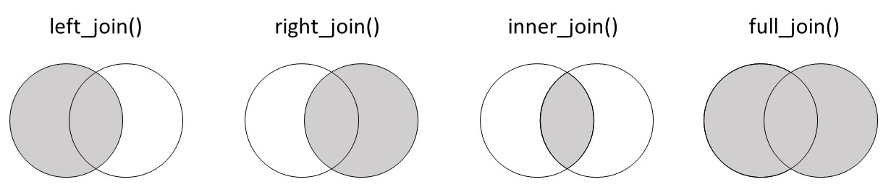

```{r, echo = F, message = F, warning = F}
# Load packages 
if(!require(pacman)) install.packages("pacman")
pacman::p_load(rlang, tidyverse, knitr, here, reactable, gt, flextable)

## functions
source(here::here("global/functions/misc_functions.R"))

## default render
knitr::opts_chunk$set(class.source = "tgc-code-block", render = reactable_5_rows)

```

# Prelude

Joining datasets is a crucial skill when working with health-related data as it allows you to combine information from multiple sources, leading to more comprehensive and insightful analyses. In this lesson, you'll learn how to use different joining techniques using R's `dplyr` package. Let's get started!


# Learning Objectives

-   You understand how each of the different `dplyr` joins work: left, right, inner and full.  

-   You're able to choose the appropriate join for your data

-   You can join simple datasets together using functions from `dplyr`

    
## Packages

‣ Please **load the packages** needed for this lesson

```{r}
# Load packages
if(!require(pacman)) install.packages("pacman")
pacman::p_load(tidyverse, countrycode)
```

## What is a join and why do we need it?

‣ To illustrate **the utility of joins**, let's start with a toy example.

‣ Consider the following two datasets: `demographic` and `test_info`

‣ `demographic`: Contains names and ages of three patients

```{r}
________________ <- 
  tribble(~name,     ~age,
          "Alice",    25,
          "Bob",      32,
          "Charlie",  45)
```

‣ `test_info`: Contains tuberculosis test dates and results for those patients

```{r}
______________ <- 
  tribble(~name,     ~test_date,    ~result,
          "Alice",   "2023-06-05",  "Negative",
          "Bob",     "2023-08-10",  "Positive",
          "Charlie", "2023-07-15",  "Negative")
```

‣ We'd like to **analyze these data together**, thus we need to combine them.
 ‣ One option: `cbind()` function from base R

```{r}
# Use the cbind function
________(demographic, test_info)
```

‣ Issue: **Name column appears twice**

‣ What if the rows in the two datasets are **not already aligned**?

‣ For example: `test_info_disordered`

```{r}
test_info_disordered <- 
  tribble(~name,     ~test_date,    ~result,
          "Bob",     "2023-08-10",  "Positive", # Bob in first row
          "Alice",   "2023-06-05",  "Negative",
          "Charlie", "2023-07-15",  "Negative")
test_info_disordered
cbind(demographic, test_info_disordered)
```

‣ The data is combined incorrectly. Very naive

‣ A third issue: **One-to-many relationship**

‣ Example: Alice did multiple TB tests

```{r}
test_info_multiple <- 
  tribble(~name,     ~test_date,    ~result,
          "Alice",   "2023-06-05",  "Negative",
          "Alice",   "2023-06-06",  "Negative",
          "Bob",     "2023-08-10",  "Positive",
          "Charlie", "2023-07-15",  "Negative")
test_info_multiple
```

‣ `cbind()` would not work here due to a mismatch in row counts:

```{r eval = F}
cbind(demographic, test_info_multiple)
```

**Vocab Time**

‣ **One-to-many relationship**: One entity in one dataset, multiple matched entities in another dataset. Will consider in future lesson.

‣ We need a smarter way to combine datasets

## Introduction to `left_join()`

‣ Solves the problems encountered with `cbind()`

‣ **Simple Case**: Works when datasets are perfectly matched.

```{r}
left_join(________________, ________________)
```

‣ Does not duplicate the name column.

‣ **Disordered Data**: Works even if the datasets are not in the same order

```{r}
left_join(demographic, ________________)
```

‣ **One to Many**: Can handle multiple entries for a single entity

```{r}
left_join(demographic, ________________)
```

‣ **Efficiency and Clarity**: Simple yet powerful

**Piping with `left_join()`**

‣ Using the pipe operator `%>%` with `left_join()`

```{r results = "hide"}
demographic %>% left_join(test_info) # equivalent:
left_join(demographic, test_info)
```

## Joining syntax

‣ Joins operate on two dataframes: `x` (the *left* dataframe) and `y` (the *right* dataframe).

‣ You can input these dataframes either as **named** or **unnamed** arguments:

```{r eval = FALSE}
# Let's try both ways:
left_join(________________________) # named
left_join(________________________) # unnamed
```

‣ The `by` argument indicates the **key** for connecting tables. Sometimes it is not needed:

```{r eval = F}
# these are equivalent
left_join(x = demographic, y = test_info)  
left_join(x = demographic, y = test_info, ________)
```

‣ Sometimes, it's not necessary to supply `by`; it can be **inferred** from common columns.

```{r eval = FALSE}
# Here, "name" is the common column:
left_join(________________________)  
left_join(________________________)
```

‣ `by` is sometimes required: what if keys are **named differently** in the two datasets?

```{r}
___________________ <- 
  tribble(~test_recipient,   ~test_date,       ~result, # replace `name` with different word
          "Alice",     "2023-06-05",  "Negative",
          "Bob",       "2023-08-10",  "Positive",
          "Charlie",   "2023-07-15",  "Negative")
___________________
```

‣ Attempting to join `test_info_different_name` with `demographic` will lead to an error:

```{r eval = FALSE}
left_join(________________, ________________)
```

‣ **Why? No obvious key**

‣ Either **rename the column** or specify columns to join on using `by = c()`.

```{r}
left_join(demographic, test_info_different_name, 
          by = c("name" = "test_recipient"))
```

‣ `c("name" = "test_recipient")` tells R to connect `name` from data frame x with `test_recipient` from data frame y.

::: practice
**Left Join Patients and Checkups**

Consider the two datasets below, one with patient details and the other with medical check-up dates for these patients.

```{r}
patients <- tribble(
  ~patient_id, ~name,     ~age,
  1,          "John",      32,
  2,          "Joy",       28,
  3,          "Khan",      40
)

checkups <- tribble(
  ~patient_id, ~checkup_date,
  1,          "2023-01-20",
  2,          "2023-02-20",
  3,          "2023-05-15"
) 
```

Join the `patients` dataset with the `checkups` dataset using `left_join()`
:::

::: practice
**Left Join with by Argument**

Two datasets are defined below, one with patient details and the other with vaccination records for those patients.

```{r}
# Patient Details
patient_details <- tribble(
  ~id_number,  ~full_name,   ~address,
  "A001",      "Alice",      "123 Elm St",
  "B002",      "Bob",        "456 Maple Dr",
  "C003",      "Charlie",    "789 Oak Blvd"
)

# Vaccination Records
vaccination_records <- tribble(
  ~patient_code, ~vaccine_type,  ~vaccination_date,
  "A001",        "COVID-19",     "2022-05-10",
  "B002",        "Flu",          "2023-09-01",
  "C003",        "Hepatitis B",  "2021-12-15"
)
```

Join the `patient_details` and `vaccination_records` datasets. You will need to use the `by` argument because the patient identifier columns have different names.
:::

# Types of joins

‣ In real-world, datasets do not match perfectly. Won't always have Alice, Bob and Charlie in both datasets.

‣ Not every row in one dataset has a corresponding row in the other

‣ Different types of joins handle these imperfect matches: `left_join()`, `right_join()`, `inner_join()`, `full_join()`

## `left_join()`

‣ `left_join()` retains all records from the left dataframe

‣ Even if there is no match in the right dataframe

‣ Let's revisit `demographic` dataset and a modified `test_info` dataset

```{r}
demographic
test_info
```

‣ Removing `Charlie`, adding a new patient `Xavier` to `test_info` dataset

```{r}
# Create and display modified test_info dataset
____________________ <- tribble(
  ~name,    ~test_date, ~result,
  "Alice",  "2023-06-05", "Negative",
  "Bob",    "2023-08-10", "Positive",
  "Xavier", "2023-05-02", "Negative")
____________________
```

‣ Now, perform a `left_join()`:

```{r}
# Perform a left join with `demographic` as left dataframe
left_join(x = ____________________, y = ____________________)
# What will happen to Charlie and what will happen to Xavier?
```

‣ `Charlie` is retained with `NA` values for test info

‣ `Xavier` is discarded

‣ In `left_join(x = demographic, y = test_info_xavier)`, all records from the **left** dataframe (`demographic`) are retained.

‣ Visual representation of how `left_join()` works
 


‣ What happens when we switch the left and right datasets?

```{r render=reactable_5_rows}
# Perform a left join with test_info_xavier as left dataframe
left_join(____________________, _____________________  )
```

‣ Now, Xavier's data is included and Charlie's data is excluded. `left_join()` retains all rows from the left dataset, `test_info_xavier`

::: vocab
**Primary Dataset**: This is the "main" or "prioritized" dataset in a join. In a left join, the left dataset is the primary dataset.
:::

::: practice
**Left Join Diagnoses and Demographics**

Try out the following. Below are two datasets - one with disease diagnoses (`disease_dx`) and another with patient demographics (`patient_demographics`).

```{r}
disease_dx <- tribble(
  ~patient_id, ~disease,       ~date_of_diagnosis,
  1,            "Influenza",    "2023-01-15",
  4,            "COVID-19",     "2023-03-05",
  8,            "Influenza",    "2023-02-20",
)

patient_demographics <- tribble(
  ~patient_id, ~name,      ~age,  ~gender,
  1,            "Fred",      28,  "Female",
  2,            "Genevieve", 45,  "Female",
  3,            "Henry",     32,  "Male",
  5,            "Irene",     55,  "Female",
  8,            "Jules",     40,  "Male"
)
```

Use `left_join()` to merge these datasets, keeping only patients for whom we have demographic information. Think carefully about which dataset to put on the left.
:::

------------------------------------------------------------------------

‣ In this example, we'll analyze TB incidence and government health expenditure in 47 African countries

‣ **Data on TB incidence rate** per 100,000 people from the [World Health Organization (WHO)](https://www.who.int/data/gho/data/indicators/indicator-details/GHO/incidence-of-tuberculosis-(per-100-000-population-per-year))

```{r}
tb_2019_africa <- read_csv(here("data/tb_incidence_2019.csv"))
tb_2019_africa
```

‣ **Data on health expenditure per capita** from countries around the world, also from the WHO

```{r}
health_exp_2019 <- read_csv(here("data/health_expend_per_cap_2019.csv"))
health_exp_2019
```

‣ Imagine you wanted to see how TB incidence varies with health expenditure in African countries? Which dataset should be on the left?

‣ Use `tb_2019_africa` as the **left dataframe** in the join to ensure all African countries are included in the final dataset

```{r}
__________________ <- 
  __________________ %>%
  left_join(__________________)
```

‣ 47 rows retained for the 47 African countries.

‣ Next, check for any countries in `tb_2019_africa` that did not have a match in `health_exp_2019`

```{r}
tb_health_exp_joined %>% 
  filter(is.na(expend_usd))
```

‣ Mauritius, South Sudan, and Comoros did not have expenditure data, but are still in the joined dataset

‣ Confirm these countries are absent from the expenditure dataset

```{r}
health_exp_2019 %>% 
  filter(country %in% c("Mauritius", "South Sudan", "Comoros"))
```

‣ Will have to leave these countries out of the analysis.

::: practice
**Left Join TB Cases and Continents**

Copy the code below to define two datasets.

The first, `tb_cases_children` contains the number of TB cases in under 15s in 2012, by country:

```{r}
tb_cases_children <- tidyr::who %>% 
  filter(year == 2012) %>% 
  transmute(country, tb_cases_smear_0_14 = new_sp_m014 + new_sp_f014)

tb_cases_children
```
 
And `country_continents`, from the {countrycode} package, lists all countries and their corresponding region and continent:

```{r}
country_continents <- 
  countrycode::codelist %>% 
  select(country.name.en, continent, region)

country_continents
```

Your goal is to add the continent and region data to the TB cases dataset.

Which dataset should be the left dataframe, `x`? And which should be the right, `y`? Once you've decided, join the datasets appropriately using `left_join()`.
:::

## `right_join()`

‣ A `right_join()` is like a mirror image of a `left_join()`

‣ Retains all rows from the **RIGHT dataset**

‣ Example using the `demographic` and `test_info_xavier` datasets

```{r}
# Recall the demographic and test_info_xavier datasets
demographic
test_info_xavier
```

‣ Now, let's use `right_join()` with `demographic` as the right dataframe

```{r}
right_join(_____________________, _____________________)
```

‣ All rows from `demographic` are kept (Alice, Bob and Charlie)

‣ Only matching records in `test_info_xavier` are kept

‣ Right join prioritizes the dataset on the right, `demographic`

‣ The image below illustrates the `right_join()` process


‣ The same final dataframe can be created with either `left_join()` or `right_join()`

‣ It depends on the order of the data frames

```{r}
# Using right_join
__________(__________________, __________________)

# Using left_join
__________(__________________, __________________)
```

::: side-note
‣ Column order may vary between `left_join()` and `right_join()`

‣ Columns can be rearranged, so no need to worry about their order
:::

‣ Data scientists typically favor `left_join()` over `right_join()`

‣ Clearer logic and less error-prone. Primary dataset (`x`) comes FIRST in the function.

‣ No practice question here. Just ignore `right_join()`. By the time you need it, you'll know what to do.

‣ Moving on from `left_join()` and `right_join()`, let's explore `inner_join()` and `full_join()`.

## `inner_join()`

‣ `inner_join` keeps rows that are **common to both** dataframes.

‣ Let's revisit our example with patients and their COVID test results.

```{r}
demographic
test_info_xavier
```

‣ Think about what the result would be using `inner_join()`.

‣ Only `Alice` and `Bob` are in *both* datasets.

```{r}
__________(____________________, ____________________)
```

‣ `Charlie` was only in `demographic`, `Xavier` was only in `test_info`, so they are removed.

‣ The order of datasets in `inner_join()` does *not* affect the result.

```{r}
__________(____________________, ____________________ )
```

::: practice
**Inner Join Pathogens**

The following data is on foodborne-outbreaks in the US in 2019, from the [CDC](https://wwwn.cdc.gov/FoodNetFast/PathogenSurveillance/AnnualSummary). Copy the code below to create two new dataframes:

```{r}
total_inf <- tribble(
  ~pathogen,         ~total_infections,   
  "Campylobacter",    9751,     
  "Listeria",         136,   
  "Salmonella",       8285,
  "Shigella",         2478,    
)

outcomes <- tribble(
  ~pathogen,        ~n_hosp,    ~n_deaths,
  "Listeria",          128,        30,
  "STEC",              582,        11,
  "Campylobacter",     1938,       42,
  "Yersinia",          200,        5,
)
```

Which pathogens are common between both datasets? Use an `inner_join()` to join the dataframes, in order to keep only the pathogens that feature in both datasets.
:::

‣ Now, let's return to our health expenditure and TB incidence rates data.

```{r}
tb_2019_africa
health_exp_2019
```

‣ Create a new dataframe, `inner_exp_tb`, to retain only countries present in both datasets.

```{r}
__________ <- tb_2019_africa %>% 
  inner_join(____________________)
```

‣ `inner_join()` is a commonly used join, but remember it can exclude a lot of data.

‣ Next, we will explore `full_join()`, the most inclusive join.

::: r-practice
**Inner Join One Row**

The code chunk below filters the `health_exp_2019` dataset to the 70 countries with the highest spending:

```{r}
highest_exp <- 
  health_exp_2019 %>% 
  arrange(-expend_usd) %>% 
  head(70)
```

Use an `inner_join()` to join this `highest_exp` dataset with the African TB incidence dataset, `tb_2019_africa`.

If you do this correctly, there will be just one row returned. Why?
:::

## `full_join()`

‣ `full_join()` retains all records from both datasets.

‣ If there are missing matches between the datasets, the function fills in with `NA`.

‣ Let's demonstrate this with the `demographic` and `test_info_xavier` datasets.

```{r}
demographic
test_info_xavier
```

```{r}
# `full_join` with `demographic` as the primary dataset.
full_join(___________________________)
```

‣ All rows are kept, preventing information loss.

‣ The order of datasets affects the order of columns, but not the retained information.

```{r}
full_join(___________________________)
```

‣ Again, all data is retained with missing values filled as `NA`.

{width="694"}

**PRACTICE TIME !**

::: practice
**Full Join Malaria Data**

The following dataframes contain global malaria incidence rates per 100'000 people and global death rates per 100'000 people from malaria, from [Our World in Data](https://ourworldindata.org/malaria). Copy the code to create two small dataframes:

```{r}
malaria_inc <- tribble(
  ~year, ~inc_100k,
  2010, 69.485344,
  2011, 66.507935,
  2014, 59.831020,
  2016, 58.704540,
  2017, 59.151703,
)

malaria_deaths <- tribble(
  ~year, ~deaths_100k,
  2011, 12.92,
  2013, 11.00,
  2015, 10.11,
  2016, 9.40,
  2019, 8.95
)
```

Then, join the above tables using a `full_join()` in order to retain all information from the two datasets.
:::

‣ Now, let's revisit the TB dataset and health expenditure dataset.

```{r}
tb_2019_africa 
health_exp_2019
```

‣ Create a new dataframe, `full_tb_health`, using a `full_join`.

```{r}
full_tb_health <- tb_2019_africa %>%
 full_join(___________________________)
full_tb_health
```

‣ All rows are kept, with `NA` for missing values.

------------------------------------------------------------------------

‣ Venn diagrams of Left, Right, Inner and Full join:



# Learning Objectives

-   You understand how each of the different `dplyr` joins work: left, right, inner and full.

-   You're able to choose the appropriate join for your data

-   You can join simple datasets together using functions from `dplyr`
