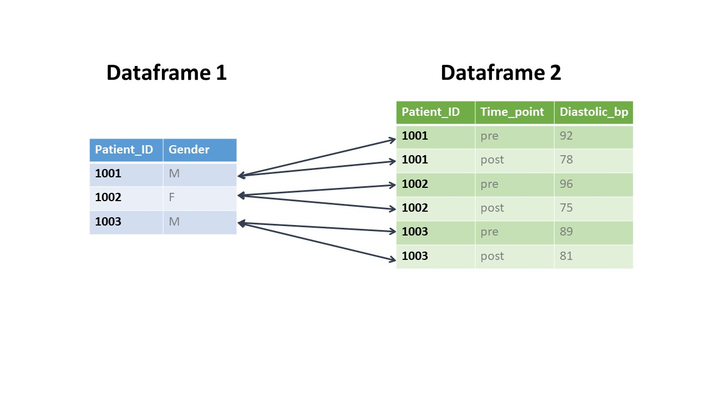

```{r, echo = F, message = F, warning = F}
# Load packages 
if(!require(pacman)) install.packages("pacman")
pacman::p_load(rlang, tidyverse, knitr, here, reactable, gt, flextable)

## functions
source(here::here("global/functions/misc_functions.R"))

## default render
registerS3method("reactable_5_rows", "data.frame", reactable_5_rows)
knitr::opts_chunk$set(class.source = "tgc-code-block")
```

# Introduction

Now that we have a solid grasp on the different types of joins and how they work, we can look at how to manage messier and more complex datasets. Joining real-world data from different sources often requires a bit of thought and cleaning ahead of time.

------------------------------------------------------------------------

# Learning Objectives

-   You know how to check for mismatched values between dataframes

-   You understand how to join using a one-to-many match

-   You know how to join on multiple key columns

------------------------------------------------------------------------

# Packages

Please load the packages needed for this lesson with the code below:

```{r warning = F, message = F, echo = T}
if(!require(pacman)) install.packages("pacman")
pacman::p_load(tidyverse, countrycode)
```

------------------------------------------------------------------------

# Pre-join data cleaning: addressing data inconsistencies

## A toy example

Often you will need to pre-clean your data when you draw it from different sources before you're able to join it. This is because there can be inconsistencies in ways that values are recorded in different tables such as spelling errors, differences in capitalization, and extra spaces. In order to join values, we need them to match perfectly. If there are any differences, R considers them to be different values.

To illustrate this, let's return to our mock patient data from the first lesson. If you recall, we had two dataframes, one called `demographic` and the other called `test_info`. We can recreate these datasets but change `Alice` to `alice` in the `demographic` dataset and keep all other values the same.

```{r render = reactable_5_rows}
demographic <- tribble(
  ~name,     ~age,
  "Alice",    25,
  "Bob",      32,
  "Charlie",  45,
)
demographic

test_info <- tribble(
  ~name,  ~test_date,    ~result,
  "alice",        "2023-06-05",  "Negative",
  "Bob",          "2023-08-10",  "Positive",
  "charlie",       "2023-05-02",  "Negative",
)
test_info
```

Now let's try a `left_join()` and `inner_join()` on our two datasets.

```{r render = reactable_5_rows}
left_join(demographic, test_info, by="name")
inner_join(demographic, test_info, by="name")
```

As we can see, R didn't recognize `Alice` and `alice` as the same person, and it also could not match `Charlie` and `charlie`. So in the `left_join()`, `Alice` and `Charlie` are left with NAs, and in the `inner_join()`, they are dropped.

How can we fix this? We need to ensure that the names in both datasets are in title case, with a capitalized first letter. For this we can use `str_to_title()`. Let's try it:

```{r render = reactable_5_rows}
test_info_title <- test_info %>%
  mutate(name = str_to_title(name)) # convert to title case
test_info_title

left_join(demographic, test_info_title, by = "name")
inner_join(demographic, test_info_title, by = "name")
```

That worked perfectly! We won't go into detail about all the different functions we can use to modify strings. The important part of this lesson is that we will learn how to identify mismatched values between dataframes.

::: practice

*(NOTE: Answers are at the bottom of the page. Try to answer the questions yourself before checking.)*

### Q: Inner Join countries {.unlisted .unnumbered}

The following two datasets contain data for India, Indonesia, and the Philippines. However an `inner_join()` of these datasets produces no output. What are the differences between the values in the key columns that would have to be changed before joining the datasets? 

```{r}
df1 <- tribble(
  ~Country,     ~Capital,
  "India",      "New Delhi",
  "Indonesia",  "Jakarta",
  "Philippines", "Manila"
)

df2 <- tribble(
  ~Country,     ~Population,   ~Life_Expectancy,
  "India ",      1393000000,   69.7,
  "indonesia",   273500000,    71.7,
  "Philipines",  113000000,    72.7
)

inner_join(df1, df2)
```
:::

## Real Data Example 1: Key Typos

In small datasets such as our mock data above, it's quite easy to notice the differences between values in our key columns. But what if we have much bigger datasets? To illustrate this, let's take a look at two real-world datasets on TB in India.

Our first dataset contains data on TB notifications (TB cases or relapses) in 2022 for all 36 Indian states and Union Territories, taken from the [Government of India Tubrculosis Report](https://data.gov.in/catalog/india-tuberculosis-report-2023). 

```{r message=FALSE, render = reactable_5_rows}
tb_notifs <- read_csv(here("data/notif_TB_india_modified.csv"))

tb_notifs_public <- tb_notifs %>% 
  filter(hc_type == "public") %>% # we want only public systems for now
  select(-hc_type)

tb_notifs_public
```

The variables are the state/Union Territory name and the number of TB notifications from 2022.

------------------------------------------------------------------------

Our second dataset is on COVID screening among TB cases for 36 Indian states taken from the same [TB Report](https://data.gov.in/catalog/india-tuberculosis-report-2023): 

```{r message=FALSE, render = reactable_5_rows}
covid_screening <- read_csv(here("data/COVID_india_modified.csv")) 

covid_screening_public <- covid_screening %>% 
  filter(hc_type == "public") %>% # we want only public systems for now
  select(-hc_type)

covid_screening_public
```

It contains the state/Union Territory name and the number of TB patients who tested positive for COVID-19, `tb_covid_pos`. Note that there are some missing values in this dataset.

Now, we'd like to join these two datasets, to allow us to calculate the percentage of TB patients in each state who tested positive for COVID-19.

Let's give it a go using `inner_join()`: 

```{r, render = reactable_5_rows}
tb_notifs_and_covid_screening <- 
  inner_join(tb_notifs_public, covid_screening_public)
tb_notifs_and_covid_screening
```

We can now perform the percentage calculation:

```{r, render = reactable_5_rows}
tb_notifs_and_covid_screening %>% 
  mutate(pct_covid_pos = 100 * tb_covid_pos/tb_notif_count) 
```

Seems alright!

However, notice that we now only have 32 rows in the output dataset, even though both initial datasets had 36 rows. Whenever you lose data in this way, it is worth investigating.

In this case, it turns out that there are several regions spelled differently in the two datasets. Because of these "key typos" could not be joined and were therefore dropped. How can we identify these to avoid information loss?

::: vocab

Recall that a "key" refers to the column(s) used to match rows across datasets in a join. The join matches rows that have identical values in the key columns.

Key typos are spelling or formatting inconsistencies in the values of key columns across datasets. For example, one dataset may list "New Delhi" while the other lists "Delhi". Because of these inconsistencies, rows that should match can't be joined properly and are dropped.

:::

### Identifying unmatched values with `setdiff()`

To identify these key typos, we can compare which values are in one data frame but not the other using the `setdiff()` function. 

Let's start by comparing the `state` values from `tb_notifs_public` dataframe to the `state` values from the `covid_screening_public` dataframe.

```{r}
setdiff(tb_notifs_public$state, covid_screening_public$state)
```

So what does the list above tell us? By putting the `tb_notifs_public` dataset first, we are asking R "which values are in `tb_notifs_public` but *not* in `covid_screening_public`?" 

We can (and should!) also switch the order of the datasets to check the reverse, asking "which values are in `covid_screening_public` but not in `tb_notifs_public`?" Let's do this and compare the two lists.

```{r}
setdiff(covid_screening_public$state, tb_notifs_public$state)
```

As we can see, there are four values in `covid_screening_public` that have spelling errors or are written differently than in `tb_notifs_public`. In this case, the easiest thing would be to clean our `covid_screening_public` data using the `case_when()` function to have our two dataframes match. Let's clean this up and then compare our datasets again.

```{r}
covid_screening_public_clean <- covid_screening_public %>% 
  mutate(state = 
           case_when(state == "ArunachalPradesh" ~ "Arunachal Pradesh", 
                     state == "tamil nadu" ~ "Tamil Nadu", 
                     state == "Tri pura" ~ "Tripura", 
                     state == "Dadra & Nagar Haveli and Daman & Diu" ~ "Dadra and Nagar Haveli and Daman and Diu",
                     TRUE ~ state))

setdiff(tb_notifs_public$state, covid_screening_public_clean$state) 
setdiff(covid_screening_public_clean$state, tb_notifs_public$state)
```

Great! Now we have no more differences in the region's names.

We can now perform our join without unnecessary data loss:

```{r, render = reactable_5_rows}
inner_join(tb_notifs_public, covid_screening_public_clean)
```

All 36 rows are retained!

### Identifying unmatched values with `antijoin()`

The `anti_join()` function in {dplyr} is a handy alternative to `setdiff()` for identifying discrepancies in key columns before joining two dataframes. It returns all rows from the first dataframe where the key values don't match the second dataframe.

For example, to find unmatched `state` values in `tb_notifs_public` when compared to `covid_screening_public`, you can use:

```{r, render = reactable_5_rows}
anti_join(tb_notifs_public, covid_screening_public)
```

And vice versa, to find the `state` values that are in `covid_screening_public` but not in `tb_notifs_public`, you can run:

```{r, render = reactable_5_rows}
anti_join(covid_screening_public, tb_notifs_public)
```

This method returns the entire rows where discrepancies occur, providing more context and potentially making it easier to diagnose and fix the issues.

After identifying these, we can again fix the errors with `mutate()` and proceed with the join.

::: practice

### Q: Check and fix typos before join {.unlisted .unnumbered}

The following dataframe, also taken from the [TB Report](https://data.gov.in/catalog/india-tuberculosis-report-2023), contains information on the number of pediatric TB cases and the number of pediatric patients initiated on treatment.

```{r message=FALSE, render = reactable_5_rows}
child <- read_csv(here("data/child_TB_india_modified.csv"))

child_public <- child %>% 
  filter(hc_type == "public") %>% 
  select(-hc_type)

child_public 
```


1. Using `set_diff()` or `anti_join()` compare the key values from the `child_public` dataframe with those from the `tb_notifs_public` dataframe, which was defined previously
2. Make any necessary changes to the `child_public` dataframe to ensure that the values match.
3. Join the two datasets.
4. Identify which two regions have the highest proportion of TB cases in children.

:::

## Real Data Example 2: Key Typos and Data Gaps

In a previous example, we saw how key typos—spelling and formatting inconsistencies—can prevent a successful join between datasets. Now, let's delve into a slightly more complex scenario.

We start with the `covid_screening_public` dataset that has 36 entries:

```{r, render = reactable_5_rows}
covid_screening_public
```

We aim to enhance this dataset with zoning information available in another dataset, `regions`, which contains 32 entries:

```{r message=FALSE, render = reactable_5_rows}
regions <- read_csv(here("data/region_data_india.csv"))
regions
```

The `regions` dataset columns include `zonal_council`, `subdivision_category`, and `state_UT`, which correspond to the zonal council designations, category of subdivision, and the names of states or Union Territories, respectively.

To merge this zoning information without losing rows from our original `covid_screening_public` data, we opt for a left join:

```{r, render = reactable_5_rows}
covid_regions <- left_join(covid_screening_public, 
                           regions, 
                           by = c("state" = "state_UT"))
covid_regions
```

After performing the left join, we can observe that 7 entries lack zoning information:

```{r, render = reactable_5_rows}
covid_regions %>% 
  filter(is.na(zonal_council))
```

To understand why, we investigate the discrepancies using the `anti_join()` function.

First, we check which states are present in the `regions` dataset but not in `covid_screening_public`:

```{r, render = reactable_5_rows}
anti_join(regions, covid_screening_public, by = c("state_UT" = "state"))
```

This operation reveals 3 states present in `regions` but not in `covid_screening_public`:

1. Arunachal Pradesh
2. Dadra and Nagar Haveli and Daman and Diu
3. Tripura

Then, we check which states are present in the `covid_screening_public` but not in `regions`:

```{r, render = reactable_5_rows}
anti_join(covid_screening_public, regions, by = c("state" = "state_UT"))
```

There are 7 states in `covid_screening_public` that are not matched in the `regions` dataset. Upon closer inspection, we can see that only three of these mismatches are due to key typos:...

The remaining four states—Andhra Pradesh, Chhattisgarh, Ladakh, and Tamil Nadu—are simply absent from the `regions` dataset.

To address the typos, we apply corrections similar to those in the previous example:

```{r}
covid_screening_public_fixed <- covid_screening_public %>% 
  mutate(state = 
           case_when(state == "ArunachalPradesh" ~ "Arunachal Pradesh", 
                     state == "Tri pura" ~ "Tripura", 
                     state == "Dadra & Nagar Haveli and Daman & Diu" ~ "Dadra and Nagar Haveli and Daman and Diu",
                     TRUE ~ state))
```

After applying the fixes, we perform another left join:

```{r, render = reactable_5_rows}
covid_regions_joined_fixed <- left_join(covid_screening_public_fixed, 
                                        regions, 
                                        by = c("state" = "state_UT"))
covid_regions_joined_fixed
```

A subsequent check confirms that only four entries remain without zoning information:

```{r, render = reactable_5_rows}
covid_regions_joined_fixed %>% 
  filter(is.na(zonal_council))
```

These four regions were not included in the `regions` dataset, so there is no further action we can take at this point.

Through this example, we see the challenge of ensuring that no data is lost during joins, which becomes increasingly complex with larger datasets. To handle such issues, we may employ strategies such as manual data inspection and correction, or fuzzy matching for imperfect string comparisons, using tools like the `{fuzzyjoin}` package in R.

::: side-note

Identifying and correcting typographical errors in large datasets to be joined is a non-trivial task. There is no fully automated method for cleaning such discrepancies, and often, fuzzy matching—joining datasets based on non-exact string matches—may be the practical solution. You can look into the {fuzzyjoin} R package for information on this.

:::

::: practice

### Q: Merging TB Cases with Geographic Data {.unlisted .unnumbered}

Run the code bellow to define two datasets. 

The first, `top_tb_cases_kids` records the top 20 countries with the highest incidence of tuberculosis (TB) in children for the year 2012:

```{r, render = reactable_5_rows}
top_tb_cases_kids <- tidyr::who %>% 
  filter(year == 2012) %>% 
  transmute(country, iso3, tb_cases_smear_0_14 = new_sp_m014 + new_sp_f014) %>% 
  arrange(desc(tb_cases_smear_0_14)) %>% 
  head(20)

top_tb_cases_kids
```

And `country_regions` lists countries along with their respective regions and continents:

```{r, render = reactable_5_rows}
country_regions <- countrycode::codelist %>% 
  select(country_name = iso.name.en, iso3c, region) %>% 
  filter(complete.cases(country_name, region))

country_regions
```

Your task is to augment the TB cases data with the region and continent information without losing any relevant data.

1. Perform a `left_join` of `top_tb_cases_kids` with `country_regions` with the country names as the key. Identify which five countries fail to match correctly.

```{r eval = F}
left_join(top_tb_cases_kids, _______________________, by = __________)
```

2. Using the code below, amend the country names in `top_tb_cases_kids` using `case_when` to rectify mismatches:

```{r}
top_tb_cases_kids_fixed <- top_tb_cases_kids %>%
  mutate(country = case_when(
    country == "Democratic Republic of the Congo" ~ "Congo (the Democratic Republic of the)",
    country == "Philippines" ~ "Philippines (the)",
    country == "Democratic People's Republic of Korea" ~ "Korea (the Democratic People's Republic of)",
    country == "United Republic of Tanzania" ~ "Tanzania, the United Republic of",
    country == "Cote d'Ivoire" ~ "Côte d'Ivoire",
    TRUE ~ country 
  ))

top_tb_cases_kids_fixed
```

Now attempt the join again using the revised dataset.

```{r eval = F}
left_join(top_tb_cases_kids_fixed, _______________________, by = __________)
```

3. Try another `left_join`, but this time use the three-letter ISO code as the key. Do those initial five countries now align properly?

```{r eval = F}
left_join(top_tb_cases_kids, _______________________, by = __________)
```

4. What is the advantage of utilizing ISO codes when recording and storing country information?

:::

------------------------------------------------------------------------

# One-to-many relationships

So far, we have primarily looked at one-to-one joins, where an observation in one dataframe corresponded to only one observation in the other dataframe. In a one-to-many join, an observation one dataframe corresponds to multiple observations in the other dataframe. 

The image below illustrates this concept:



To illustrate a one-to-many join, let's return to our patients and their COVID test data. Let's imagine that in our dataset, `Alice` and `Xavier` got tested multiple times for COVID. We can add two more rows to our `test_info` dataframe with their new test information:

```{r, render = reactable_5_rows}
test_info_many <- tribble(
  ~name,    ~test_date, ~result,
  "Alice",  "2023-06-05", "Negative",
  "Alice",  "2023-06-10", "Positive",
  "Bob",    "2023-08-10", "Positive",
  "Xavier", "2023-05-02", "Negative",
  "Xavier", "2023-05-12", "Negative",
)
```

Next, let's take a look at what happens when we use a `left_join()` with `demographic` as the dataset to the left of the call:

```{r, render = reactable_5_rows}
left_join(demographic, test_info_many)
```

What´s happened above? Basically, when you perform a one-to-many join, the data from the "one" side are duplicated for each matching row of the "many" side. The graphic below illustrates this process:


::: practice

### Q: Merging One-to-Many Patient Records {.unlisted .unnumbered}

Copy the code below to create two small dataframes:

```{r}
patient_info <- tribble(
  ~patient_id, ~name,     ~age,
  1,          "Liam",     32,
  2,          "Manny",    28,
  3,          "Nico",     40
)

conditions <- tribble(
  ~patient_id, ~disease,
  1,           "Diabetes",
  1,           "Hypertension",
  2,           "Asthma",
  3,           "High Cholesterol",
  3,           "Arthritis"
)

```

If you use a `left_join()` to join these datasets, how many rows will be in the final dataframe? Try to figure it out and then perform the join to see if you were right!

:::

Let's apply this to our real-world datasets. The first dataset that we'll work with is the `tb_notifs` dataset. Here is what it looks like:

```{r, render = reactable_5_rows}
tb_notifs
```

Note that this dataset is a long dataset, with two rows per state, one for notifications from public health facilities in the state and one for private health facilities.

The second dataset is an Indian regions dataset:

```{r, render = reactable_5_rows}
full_regions <- read_csv(here("data/region_data_india_full.csv"))
full_regions
```
Let's try joining the datasets:

```{r, render = reactable_5_rows}
notif_regions <- tb_notifs %>% 
  left_join(regions, by = c("state" = "state_UT"))
notif_regions
```

As expected, the data from the `regions` dataframe was duplicated for every matching value of the `tb_notifs` dataframe.

------------------------------------------------------------------------

# Multiple key columns

Sometimes we have more than one column that uniquely identifies the observations that we want to match on. For example, let's imagine that we have systolic blood pressure measures for three patients before (pre) and after (post) taking a new blood pressure drug.

```{r, render = reactable_5_rows}
blood_pressure <- tribble(
  ~name,    ~time_point,  ~systolic, 
  "Alice",   "pre",         139,      
  "Alice",   "post",        121,      
  "Bob",     "pre",         137,      
  "Bob",     "post",        128,      
  "Charlie", "pre",         137,      
  "Charlie", "post",        130 )
```

Now, let's imagine we have another dataset with the same 3 patients and their serum creatinine levels before and after taking the drug. Creatinine is a waste product that is normally processed by the kidneys. High creatinine levels may be a side effect of the drug being tested.

```{r, render = reactable_5_rows}
kidney <- tribble(
  ~name,    ~time_point,  ~creatinine,
  "Alice",   "pre",         0.9,
  "Alice",   "post",        1.3,
  "Bob",     "pre",         0.7,
  "Bob",     "post",        0.8,
  "Charlie", "pre",         0.6,
  "Charlie", "post",        1.4
)
```

We want to join the two datasets so that each patient has two rows, one row for their levels before the drug and one row for their levels after. To do this, our first instinct may be to join on the patients name. Let's try it out and see what happens:

```{r, render = reactable_5_rows}
bp_kidney_dups <- blood_pressure %>% 
  left_join(kidney, by="name")
bp_kidney_dups
```

As we can see, this isn't what we wanted at all! We end up with duplicated rows. Now we have FOUR rows for each person. And R gives a warning message that this is considered a "many-to-many" relationship because multiple rows in one dataframe correspond to multiple rows in the other dataframe. As a general rule,you should avoid many-to-many joins whenever possible! Also note that since we have two columns called `time_point` (one from each dataframe), these columns in the new dataframe are differentiated by `.x` and `.y`.

What we want to do is match on BOTH `name` and `time_point`. To do this we have to specify to R that there are two columns to match on. In reality, this is very simple! All we have to do is use the `c()` function and specify both column names.

```{r, render = reactable_5_rows}
bp_kidney <- blood_pressure %>%
  left_join(kidney, by = c("name", "time_point"))
bp_kidney
```

::: side-note

Note that specifying `by = c("name", "time_point")` is different from using a named vector in the form of `by = c("keya" = "keyb")`. The former matches the columns by name across both datasets, while the latter is used to match columns with different names between two datasets.

:::

That looks great! Now let's apply this to our real-world `tb_notifs` and `covid_screening` datasets.

```{r, render = reactable_5_rows}
tb_notifs
covid_screening
```

Let's think about how we want our final dataframe to look. We want to have two rows for each state, one with the TB notification and COVID data for the public sector, and one with the TB notification and COVID data for the private sector. That means we have to match on both `state` and `hc_type`. Just as we did for the patient data, we have to specify both key values in the `by=` statement using `c()`. Let's try it out!

```{r, render = reactable_5_rows}
notif_covid <- tb_notifs %>%
  left_join(covid_screening, by=c("state", "hc_type"))
notif_covid
```

Great, that's exactly what we wanted!


::: practice

### Q: Joining three datasets, including one-to-many {.unlisted .unnumbered}

In this practice, you will join three datasets: `notif_covid`, `child`, and `regions`. Follow the steps below to ensure that no data is lost.

Follow these steps and fill in the blanked code fragments to complete the joining process.

1. Check for mismatches between `notif_covid` and `child` using `anti_join()`.

```{r eval=F}
# Check mismatches
anti_join(___________________)
anti_join(___________________)
```

2. Clean the mismatches in `child` by creating `child_fixed`. Use `case_when()` to update state names.

```{r eval=F}
# Clean mismatches
child_fixed <- child %>%
  mutate(state = case_when(
    state == "___________________" ~ "Arunachal Pradesh",
    state == "___________________" ~ "Jammu & Kashmir",
    state == "___________________" ~ "Kerala",
    state == "___________________" ~ "Puducherry",
    TRUE ~ state
  ))
```

3. Verify that the mismatches have been resolved using `anti_join()`. These should return empty dataframes.

```{r eval=F}
# Verify mismatches resolved
anti_join(child_fixed, notif_covid)
anti_join(notif_covid, child_fixed)
```

4. Join `notif_covid` and `child_fixed` using `left_join()` on `state` and `hc_type`. Assign the result to `join_1`.

```{r eval=F}
# Join notif_covid and child_fixed
join_1 <- notif_covid %>% 
  left_join(child_fixed, by = _____________)
```

5. Check for mismatches between `join_1` and `regions` using `anti_join()`.

```{r eval=F}
# Check mismatches
anti_join(join_1, regions, by = c("state" = "state_UT"))
anti_join(regions, join_1, by = c("state_UT" = "state"))
```

You may notice that some states, e.g. Ladakh, are missing from the `regions` dataset. There is nothing we can do about this for the moment, so we will proceed with the join.


6. Perform the final join using `left_join()` on `state` from `join_1` and `state_UT` from `regions`. Assign the result to `final_join`.

```{r eval=F}
# Final join
final_join <- join_1 %>% 
  left_join(___________________)
```

The question said to avoid losing information, so you may be wondering why we used a `left_join()` of a `full_join()`? The outputs are actually the same in this case. Remember that `left_join()` keeps all rows from the left dataset. The missing states we commented in step 5 are present in the left,  `join_1` dataset, so they are not lost in the final join. And when you can choose between `left_join()` and `full_join()`, it is better to use `left_join()` as it is easier for your audience to reason about what your code is doing.

7. Display the `final_join` dataset.

```{r eval=F}
# Display final_join
final_join
```

:::


------------------------------------------------------------------------

# Wrap Up!

In this lesson, we delved into the intricacies of data cleaning before a join, focusing on how to detect and correct mismatches or inconsistencies in key columns. We also highlighted the impact of one-to-many relationships in joining dataframes, showing how data from the "one" side is duplicated for each matching row of the "many" side. Finally, we demonstrated how to join dataframes using multiple key columns.
 
As we conclude this lesson, we hope that you have gained a deeper understanding of the importance and utility of joining dataframes in R.


------------------------------------------------------------------------

# Answer Key {.unnumbered}

### Q: Inner Join countries {.unlisted .unnumbered}
```{r}
df2_fixed <- df2 %>% 
  mutate(Country = 
           case_match(Country, 
                             "India " ~ "India", # Remove blank space at end
                             "indonesia" ~ "Indonesia", # Capitalize
                             "Philipines" ~ "Philippines", # Fix spelling
                             .default=Country))

inner_join(df1, df2_fixed)
```


### Q: Check and fix typos before join {.unlisted .unnumbered}

1. 
```{r}
# setdiff()
setdiff(child_public$state, tb_notifs_public$state)
setdiff(tb_notifs_public$state, child_public$state)

# antijoin
anti_join(child_public, tb_notifs_public)
anti_join(tb_notifs_public, child_public)
```


2. 
```{r}
child_public_fixed <- child_public %>%
  mutate(state = 
           case_when(state == "ArunachalPradesh" ~ "Arunachal Pradesh", 
                     state == "Jammu and Kashmir" ~ "Jammu & Kashmir", 
                     state == "kerala" ~ "Kerala", 
                     state == "Pondicherry" ~ "Puducherry",
                     TRUE ~ state))
```


3.
```{r}
child_tb_public <- child_public_fixed %>%
  inner_join(tb_notifs_public)
```

4. 
```{r render = reactable_5_rows}
child_tb_public %>%
  mutate(tb_child_prop = tb_child_notifs/tb_notif_count) %>%
  arrange(-tb_child_prop)
```


### Q: Merging TB Cases with Geographic Data {.unlisted .unnumbered}

1.
```{r render = reactable_5_rows}
left_join(top_tb_cases_kids, country_regions, by = c("country"="country_name"))
```

```{r}
setdiff(top_tb_cases_kids$country, country_regions$country_name)
```

2. 
```{r render = reactable_5_rows}
left_join(top_tb_cases_kids_fixed, country_regions, by = c("country"="country_name"))
```

3.

```{r render = reactable_5_rows}
left_join(top_tb_cases_kids, country_regions, by = c("iso3" = "iso3c"))
```

4. 

ISO codes are standardized - there in only one way of writing them. This makes it useful for joining.


### Q: Merging One-to-Many Patient Records {.unlisted .unnumbered}

```{r, render = reactable_5_rows}
# 5 rows in the final dataframe
patient_info %>% 
  left_join(conditions)
```

### Q: Joining three datasets, including one-to-many {.unlisted .unnumbered}

1. Check for mismatches between `notif_covid` and `child` using `anti_join()`.

```{r}
# Check mismatches
anti_join(child, notif_covid)
anti_join(notif_covid, child)
```

2. Clean the mismatches in `child` by creating `child_fixed`. Use `case_when()` to update state names.

```{r}
# Clean mismatches
child_fixed <- child %>%
  mutate(state = case_when(
    state == "ArunachalPradesh" ~ "Arunachal Pradesh",
    state == "Jammu and Kashmir" ~ "Jammu & Kashmir",
    state == "kerala" ~ "Kerala",
    state == "Pondicherry" ~ "Puducherry",
    TRUE ~ state
  ))
```

3. Verify that the mismatches have been resolved using `anti_join()`.

```{r}
# Verify mismatches resolved
anti_join(child_fixed, notif_covid)
anti_join(notif_covid, child_fixed)
```

4. Join `notif_covid` and `child_fixed` using `left_join()` on `state` and `hc_type`. Assign the result to `join_1`.

```{r}
# Join notif_covid and child_fixed
join_1 <- notif_covid %>% 
  left_join(child_fixed, by = c("state", "hc_type"))
```

5. Check for mismatches between `join_1` and `regions` using `anti_join()`.

```{r}
# Check mismatches
anti_join(join_1, regions, by = c("state" = "state_UT"))
anti_join(regions, join_1, by = c("state_UT" = "state"))
```

You may notice that some states, e.g. Ladakh, which are present in `join_1` are missing from the `regions` dataset. There is nothing we can do about this for the moment, so we will proceed with the join.

6. Perform the final join using `left_join()` on `state` from `join_1` and `state_UT` from `regions`. Assign the result to `final_join`.

```{r}
# Final join
final_join <- join_1 %>% 
  left_join(regions, by = c("state" = "state_UT"))
```

The question said to avoid losing information, so you may be wondering why we used a `left_join()` of a `full_join()`? The outputs are actually the same in this case. Remember that `left_join()` keeps all rows from the left dataset. The missing states we commented in step 5 are present in the left,  `join_1` dataset, so they are not lost in the final join. And when you can choose between `left_join()` and `full_join()`, it is better to use `left_join()` as it is easier for your audience to reason about what your code is doing.

7. Display the `final_join` dataset.

```{r}
# Display final_join
final_join
```


# Contributors {.unlisted .unnumbered}

The following team members contributed to this lesson:

`r tgc_contributors_list(ids = c("amckinley", "kendavidn", "camille"))` 