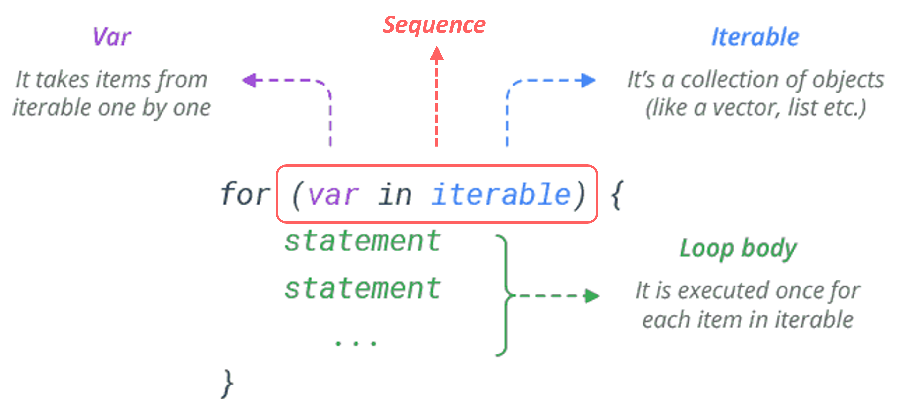
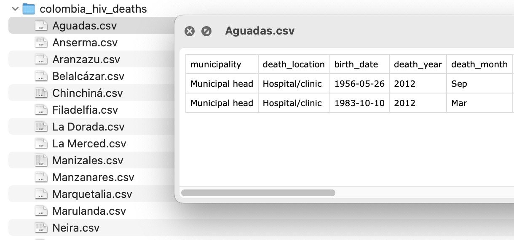
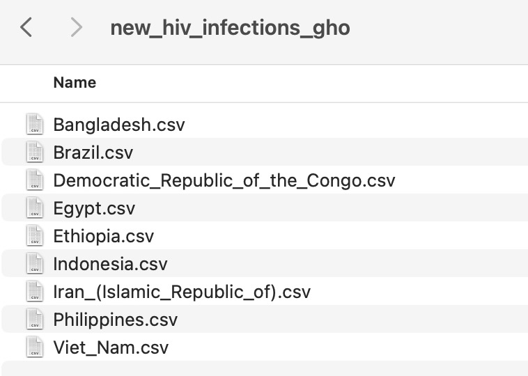

```{r, echo = F, message = F, warning = F}
# Load packages 
if(!require(pacman)) install.packages("pacman")
pacman::p_load(rlang, tidyverse, knitr, here, reactable, gt, flextable)

## functions
source(here::here("global/functions/misc_functions.R"))

## default render
registerS3method("reactable_5_rows", "data.frame", reactable_5_rows)
knitr::opts_chunk$set(class.source = "tgc-code-block", error = T)

```

# Introduction

At the heart of programming is the concept of repeating a task multiple times. A `for` loop is one fundamental way to do that. Loops enable efficient repetition, saving time and effort.

Mastering this concept is essential for writing intelligent and efficient R code.

Let's dive in and enhance your coding skills!

# Learning Objectives

By the end of this lesson, you will be able to:

-   Explain the syntax and structure of a basic `for` loop in R
-   Use index variables to iterate through multiple vectors simultaneously in a loop
-   Integrate `if/else` conditional statements within a loop
-   Store loop results in vectors and lists
-   Apply loops to tasks like analyzing multiple datasets and generating multiple plots
-   Debug loops by isolating and testing single iterations

# Packages

This lesson will require the following packages to be installed and loaded:

```{r warning = F, message = F}
# Load packages 
if(!require(pacman)) install.packages("pacman")
pacman::p_load(tidyverse, here, openxlsx, tools, outbreaks, medicaldata)
```

# Intro to `for` Loops

Let's start with a simple example. Suppose we have a vector of children's ages in years, and we want to convert these to months:

```{r}
ages <- c(7, 8, 9) # Vector of ages in years
```

We can do this easily with the `*` operation in R:

```{r}
ages * 12
```

But let's walk through how we could accomplish this using a `for` loop instead, since that is (conceptually) what R is doing under the hood.

```{r}
for (age in ages) print(age * 12)
```

In this loop, `age` is a temporary variable that takes the value of each element in `ages` during each iteration. First, `age` is 7, then 8, then 9.

You can choose any name for this variable:

```{r}
for (random_name in ages) print(random_name * 12)
```

If the content of the loop is more than one line, you need to use curly brackets `{}` to indicate the body of the loop.

```{r}
for (age in ages) {
  month_age = age * 12
  print(month_age)
}
```

The general structure of any `for` loop is illustrated in the diagram below:

{width="420"}

::: practice
### Hours to Minutes Basic Loop {.unlisted .unnumbered}

Try converting hours to minutes using a `for` loop. Start with this vector of hours:

```{r eval = F}
hours <- c(3, 4, 5) # Vector of hours
# Your code here

for ___ 
_____ # convert hours to minutes and print
```
:::

::: side-note
Loops can be nested within each other. For instance:

```{r}
for (i in 1:2) {
  for (j in 1:2) {
    print(i * j)
  }
}
```

This creates a combination of `i` and `j` values as shown in this table:

| i   | j   | i \* j |
|-----|-----|--------|
| 1   | 1   | 1      |
| 1   | 2   | 2      |
| 2   | 1   | 2      |
| 2   | 2   | 4      |

Nested loops are less common though, and often have more efficient alternatives.
:::

# Are `for` Loops Useful in R?

While `for` loops are foundational in many programming languages, their usage in R is somewhat less frequent. This is because R inherently handles *vectorized* operations, automatically applying a function to each element of a vector.

For example, our initial age conversion could be achieved without a loop:

```{r}
ages * 12
```

Moreover, R typically deals with data frames rather than raw vectors. For data frames, we often use functions from the `tidyverse` package to apply operations across columns:

```{r}
ages_df <- tibble(age = ages)
ages_df %>% 
  mutate(age_months = age * 12)
```

However, there are scenarios where loops are useful, especially when working with multiple data frames or non-dataframe (sometimes called *non-rectangular*) objects.

We will explore these later in the lesson, but first we'll spend some more time getting comfortable with loops using toy examples.

::: pro-tip
**Loops vs function mapping**

It's important to note that loops can often be replaced by custom functions which are then mapped across a vector or data frame.

We're teaching loops nonetheless because they are quite easy to learn, reason about and debug, even for beginners.
:::


# Looping with an Index

It is often useful to loop through a vector using an index (plural: indices), which is a counter that keeps track of the current iteration.

Let's look at our `ages` vector again, which we want to convert to months:

```{r}
ages <- c(7, 8, 9) # Vector of ages in years
```

To use indices in a loop, we first create a sequence that represents each position in the vector:

```{r}
1:length(ages) # Create a sequence of indices that is the same length as ages
indices <- 1:length(ages)
```

Now, `indices` has values 1, 2, 3, corresponding to the positions in `ages`. We use this in a `for` loop as follows:

```{r}
for (i in indices) {
  print(ages[i] * 12)
}
```

In this code, `ages[i]` refers to the `i`th element in our `ages` list.

The name of the variable `i` is arbitrary. We could have used `j` or `index` or `position` or anything else.

```{r}
for (position in indices) {
  print(ages[position] * 12)
}
```

Often we do not need to create a separate variable for the indices. We can just use the `:` operator to create a sequence directly in the `for` loop:

```{r}
for (i in 1:length(ages)) {
  print(ages[i] * 12)
}
```

Such index-based loops are useful for working with multiple vectors at the same time. We will see this in the next section.

::: practice
### Hours to Minutes Indexed Loop {.unlisted .unnumbered}

Rewrite your loop from last question using indices:

```{r, eval = F}
hours <- c(3, 4, 5) # Vector of hours

# Your code here

for ___ {
  ___
}
```
:::

::: side-note
The function `seq_along()` is a shortcut for creating a sequence of indices. It is equivalent to `1:length()`:

```{r}
# These two are equivalent:
seq_along(ages) 
1:length(ages)
```
:::


# Looping on Multiple Vectors

Looping with indices allows us to work with multiple vectors simultaneously. Suppose we have vectors for ages and heights:

```{r}
ages <- c(7, 8, 9) # ages in years
heights <- c(120, 130, 140) # heights in cm
```

We can loop through both using the index method:

```{r}
for(i in 1:length(ages)) {
  age <- ages[i]
  height <- heights[i]
  
  print(paste("Age:", age, "Height:", height))
}
```

In each iteration: - `i` is the index. - We extract the ith element from each vector

and print it.

Alternatively, we can skip the variable assignment and use the indices in the `print()` statement directly:

```{r}
for(i in 1:length(ages)) {
  print(paste("Age:", ages[i], "Height:", heights[i]))
}
```

::: practice
### BMI Calculation Loop {.unlisted .unnumbered}

Using a for loop, calculate the Body Mass Index (BMI) of the three individuals shown below. The formul for BMI is `BMI = weight / (height ^ 2)`.

```{r eval = F}
weights <- c(30, 32, 35) # Weights in kg
heights <- c(1.2, 1.3, 1.4) # Heights in meters

for(i in ____________________) {

  __________________________
  
  print(paste("Weight:", ____,
              "Height:", ____,
              "BMI:", ____,
              ))
  
}

```
:::

# Storing Loop Results

In most cases, you'll want to store the results of a loop rather than just printing them as we have been doing above. Let's look at how to do this.

Consider our age-to-months example:

```{r}
ages <- c(7, 8, 9) 

for (age in ages) {
  print(paste(age * 12, "months"))
}
```

To store these converted ages, we first create an empty vector:

```{r}
ages_months <- vector(mode = "numeric", length = length(ages))
# This can also be written as:
ages_months <- vector("numeric", length(ages))

ages_months # Shows the empty vector
```

This creates a numeric vector of the same length as `ages`, initially filled with zeros. To store a value in the vector, we do the following:

```{r}
ages_months[1] <- 99 # Store 99 in the first element of ages_months
ages_months[2] <- 100 # Store 100 in the second element of ages_months
ages_months
```

Now, let's execute the loop, storing the results in `ages_months`:

```{r}
ages_months <- vector("numeric", length(ages))

for (i in 1:length(ages)) {
  ages_months[i] <- ages[i] * 12
}
ages_months 
```

In this loop: 

- On the first iteration, `i` is 1. We multiply the first element of `ages` by 12 and store it in the first element of `ages_months`. 
- Then `i` is 2, then 3. In each iteration, we multiply the corresponding element of `ages` by 12 and store it in the corresponding element of `ages_months`.

::: practice
### Height cm to m {.unlisted .unnumbered}

Use a for loop to convert height measurements from cm to m. Store the results in a vector called `height_meters`.

```{r eval = F}
height_cm <- c(180, 170, 190, 160, 150) # Heights in cm 

height_m <- vector(_______________-) # numeric vector of same length as heigh_cm

for ___ {
  height_m[i] <- ________________________
}
```
:::

::: watch-out
In order to save the results from your iteration, you must create your empty object **outside** the loop. Otherwise, you will only save the result of the last iteration.

This is a common mistake. Consider the below as an example:

```{r}
ages <- c(7, 8, 9)

for (i in 1:length(ages)) {
  ages_months <- vector("numeric", length(ages))
  ages_months[i] <- ages[i] * 12
}
ages_months 
```

Do you see the problem?
:::

::: side-note
If you are in a rush, you can skip using the `vector()` function and initialize your vector with `c()` instead, then progressively fill it with values by index:

```{r}
ages_months <- c()

for (i in 1:length(ages)) {
  ages_months[i] <- ages[i] * 12
}
ages_months
```

And you can also skip the index and use `c()` to append values to the end of the vector:

```{r}
ages_months <- c()

for (age in ages) {
  ages_months <- c(ages_months, age * 12)
}
ages_months
```

However, in both of these cases, R does not know the final length of the vector as it's going through the iterations, so it has to reallocate memory at each iteration. This can cause slow performance if you are working with large vectors.
:::

# If Statements in Loops

Just as `if` statements can be used in functions, they can be integrated into loops.

Consider this example:

```{r}
age_vec <- c(2, 12, 17, 24, 60) # Vector of ages

for (age in age_vec) {
  if (age < 18) print(paste("Child, Age", age ))
}
```

It is often clearer to use curly braces to indicate the `if` statement's body. It also allows us to add more lines of code to the body of the `if` statement:

```{r}
for (age in age_vec) {
  if (age < 18) {
    print("Processing:")
    print(paste("Child, Age", age ))
  }
}
```

Let's add another condition to classify as 'Child' or 'Teen':

```{r}
for (age in age_vec) {
  if (age < 13) {
    print(paste("Child, Age", age))
  } else if (age >= 13 && age < 18) {
    print(paste("Teen, Age", age))
  }
}
```

We can include a single `else` statement at the end to catch all other ages:

```{r}
for (age in age_vec) {
  if (age < 13) {
    print(paste("Child, Age", age))
  } else if (age >= 13 && age < 18) {
    print(paste("Teen, Age", age))
  } else {
    print(paste("Adult, Age", age))
  }
}
```

To store these classifications, we can create an empty vector, and use an index-based loop to store the results:

```{r}
age_class <- vector("character", length(age_vec)) # Create empty vector
for (i in 1:length(age_vec)) {
  if (age_vec[i] < 13) {
    age_class[i] <- "Child"
  } else if (age_vec[i] >= 13 && age_vec[i] < 18) {
    age_class[i] <- "Teen"
  } else {
    age_class[i] <- "Adult"
  }
}
age_class
```

::: practice
### Temperature Classification {.unlisted .unnumbered}

You have a vector of body temperatures in Celsius. Classify each temperature as 'Hypothermia', 'Normal', or 'Fever' using a `for` loop combined with `if` and `else` statements.

Use these rules: 

- Below 36.0°C: 'Hypothermia' 
- Between 36.0°C and 37.5°C: 'Normal' 
- Above 37.5°C: 'Fever'

```{r eval = F}
body_temps <- c(35, 36.5, 37, 38, 39.5) # Body temperatures in Celsius
classif_vec <- vector(______________________) # character vec, length of body_temps
for (i in 1:length(________)) {
    # Add your if-else logic here
  if (body_temps[i] < 36.0) {
    out <- "Hypothermia" 
  } ## add other conditions
  
  
    # Final print statement
    classif_vec[i] <- paste(body_temps[i], "°C is", out)
}
classif_vec
```

An expected output is below

```         
35°C is Hypothermia
36.5°C is Normal  
37°C is Normal
38°C is Fever
39.5°C is Fever
```
:::


# Quick Techniques for Debugging `for` Loops

Efficient editing and debugging are crucial when working with `for` loops in R. There are many approaches for this, but for now, we'll show two of the simplest ones:

- Isolate and running a single iteration of the loop
- Adding `print()` statements to the loop to print out the values of variables at each iteration

## Isolating and Running a Single Iteration

Consider this loop which we saw previously:

```{r}
age_vec <- c(2, 12, 17, 24, 60) # Vector of ages
age_class <- vector("character", length(age_vec))

for (i in 1:length(age_vec)) {
  if (age_vec[i] < 18) {
    age_class[i] <- "Child"
  } else {
    age_class[i] <- "Adult"
  }
}
age_class
```

Let's see an example of an error we might run into when using the loop: 

```{r eval = F}
# Age vector from the fluH7N9_china_2013 dataset
flu_dat <- outbreaks::fluH7N9_china_2013
head(flu_dat)

flu_dat_age <- flu_dat$age
age_class <- vector("character", length(flu_dat_age))
for (i in 1:length(flu_dat_age)) {
  if (flu_dat_age[i] < 18) {
    age_class[i] <- "Child"
  } else {
    age_class[i] <- "Adult"
  }
}
```

We get this error: 

```
Error in if (flu_dat_age[i] < 18) { : 
  missing value where TRUE/FALSE needed
In addition: Warning message:
In Ops.factor(flu_dat_age[i], 18) : ‘<’ not meaningful for factors
```

You may already know what this error means, but let's say you didn't.

We can step into the loop and manually step through the first iteration to see what's going on:

```{r eval = F}
for (i in 1:length(flu_dat_age)) {
  
  # ▶️ Run from this line 
  i <- 1 # Manually set i to 1 
  
  # Then highlight `flu_dat_age[i]` and press Ctrl + Enter to run just this code
  # After that, highlight and run `flu_dat_age[i] < 18` 
  
  if (flu_dat_age[i] < 18) {
    age_class[i] <- "Child"
  } else {
    age_class[i] <- "Adult"
  }
  
}

```

Following the above process, we can see that `flu_dat_age` is a factor, not a numeric vector. We can manually change this, in the midst of the debugging process. It is a good idea to first convert the factor to a character vector, and then to a numeric vector. Otherwise, we may get unexpected results.

Consider: 

```{r}
flu_dat_age[75]
as.numeric(flu_dat_age[75])
# `?`, which stands for missing in this case is converted to 1, at it is the first level of the factor

# We therefore need: 
as.numeric(as.character(flu_dat_age[75]))
```

Now let's try to fix the loop, and run just the first iteration again:

```{r eval = F}
for (i in 1:length(flu_dat_age)) {
  
  # ▶️ Run from this line 
  i <- 1 # Manually set i to 1 
  
  age_num <- as.numeric(as.character(flu_dat_age[i]))
  
  # Then highlight `age_num < 18` and press Ctrl + Enter
  if (age_num < 18) {
    age_class[i] <- "Child"
  } else {
    age_class[i] <- "Adult"
  }
  
}
```

Now the first iteration works, but let's see what happens when we run the entire loop:

```{r eval = F}
age_class <- vector("character", length(flu_dat_age))

for (i in 1:length(flu_dat_age)) {
  age_num <- as.numeric(as.character(flu_dat_age[i]))
  
  if (age_num < 18) {
    age_class[i] <- "Child"
  } else {
    age_class[i] <- "Adult"
  }
}
head(age_class)
```

```
Error in if (age_num < 18) { : 
  missing value where TRUE/FALSE needed
```

Again, you may already know what this error means, but let's say you didn't. We'll try our next debugging technique.

## Adding Print Statements to the Loop

In the last section, we saw that the loop works fine for the first iteration, but seems to fail on a further iteration. 

To catch which the iteration fails on, we can add `print()` statements to the loop:

```{r eval = F}
for (i in 1:length(flu_dat_age)) {
  
  print(i) # Print the iteration number
  age_num <- as.numeric(as.character(flu_dat_age[i]))
  
  print(age_num) # Print the value of age_num
  
  if (age_num < 18) {
    age_class[i] <- "Child"
  } else {
    age_class[i] <- "Adult"
  }
  
  print(age_class[i]) # Print the value of the output
}
head(age_class)
```

Now, when we inspect the output, we can see that the loop fails on the 74th iteration: 

```
[1] 73 👈 73rd iteration
[1] 43 👈 Value of age_num
[1] "Adult, Age 43" 👈 Value of output on 73rd iteration
[1] 74 👈 74th iteration
[1] NA 👈 Value of age_num
```

This happens because the 74th value of `flu_dat_age` is `NA` (because of our factor to numeric conversion), so R cannot evaluate whether it is less than 18.

We can fix this by adding an `if` statement to check for `NA` values:

```{r}
for (i in 1:length(flu_dat_age)) {
  
  age_num <- as.numeric(as.character(flu_dat_age[i]))
  
  if (is.na(age_num)) {
    age_class[i] <- "NA"
  } else if (age_num < 18) {
    age_class[i] <- "Child"
  } else {
    age_class[i] <- "Adult"
  }
}
# Check the 74th value of age_class
age_class[74]
```

Great! Now we've fixed the error.

As you can see, even with our "toy" loop, debugging can be a time-consuming process. As your mother used to say "Programming is 98% debugging and 2% writing code."

::: pro-tip
R offers several other techniques for diagnosing and managing errors:

-   The `try()` and `tryCatch()` functions allow error catching while continuing the loop's execution.
-   The `browser()` function pauses the loop at a designated point, enabling step-by-step execution.

These are more advanced methods, and while they are not covered here, you can refer to the R documentation for further guidance when needed. Or consult Hadley Wickham's [Advanced R](https://adv-r.hadley.nz/) book.

:::

# Real Loops Application 1: Analyzing Multiple Datasets

Now that you have a solid understanding of `for` loops, let's apply our knowledge to a more realistic looping task: working with multiple datasets.

We have a folder of CSV files containing HIV deaths data for municipalities in Colombia.

{width="521"}

Imagine we were asked to compile a single table with the following information about each dataset: the number of rows (number of deaths), the number of columns, and the names of all columns.

We could do this one by one, but that would be tedious and error-prone. Instead, we can use a loop to automate the process.

First, let's list the files in the folder:

```{r}
colom_data_paths <- list.files(here("data/colombia_hiv_deaths"), 
                               full.names = TRUE)
head(colom_data_paths) # Show first 6 file paths
```

Now, let's import one dataset as an example to demonstrate what we want to achieve. Once we've done this, we can apply the same process to all datasets.

```{r}
colom_data <- read_csv(colom_data_paths[1]) # Import first dataset
colom_data
```

Then we apply a range of R functions to gather the information we want from each dataset:

```{r}
file_path_sans_ext(basename(colom_data_paths[1]))  # Dataset/Municipality name
nrow(colom_data) # Number of rows, which is equivalent to the number of deaths
ncol(colom_data) # Number of columns
paste(names(colom_data), collapse = ", ") # Names of all columns
```

::: side-note
`basename`: extracts the file name from a file path.

```{r}
colom_data_paths[1]
basename(colom_data_paths[1])
```

And `file_path_sans_ext` from the {tools} package removes the file extension from file names. We use it together with `basename` to get the municipality name.

```{r}
file_path_sans_ext(basename(colom_data_paths[1]))
```
:::

Now, we need to make a data frame with this information. We can use the `tibble` function to do this:

```{r}
single_row <- 
  tibble(dataset = basename(colom_data_paths[1]),
         n_deaths = nrow(colom_data),
         n_cols = ncol(colom_data),
         col_names = paste(names(colom_data), collapse = ", "))
single_row
```

So we're going to need to repeat this process for each dataset. Within the loop, we will store each single-row data frame in a list, then combine them at the end. Recall that lists are R objects that can contain any other R objects, including data frames.

Let's initialize this empty list now:

```{r}
data_frames_list <- vector("list", length(colom_data_paths))
head(data_frames_list) # Show first 6 elements
```

Let's add the first single-row data frame to the list:

```{r}
data_frames_list[[1]] <- single_row
```

Now if we look at the list, we see the first element is the single-row data frame:

```{r}
head(data_frames_list)
```

And we can access the data frame by subsetting the list:

```{r}
data_frames_list[[1]]
```

Note the use of double brackets for accessing elements of the list.

We now have all the pieces we need to create a loop that will process each dataset and store the results in a list. Let's go!

```{r, message=FALSE}
for (i in 1:length(colom_data_paths)) {
    path <- colom_data_paths[i]

    # Import
    colom_data <- read_csv(path)
   
    # Get info
    n_deaths <- nrow(colom_data)
    n_cols <- ncol(colom_data)
    col_names <- paste(names(colom_data), collapse = ", ")
  
    # Create data frame for this dataset
    hiv_dat_row <- tibble(dataset = file_path_sans_ext(basename(path)),
                          n_deaths = n_deaths,
                          n_cols = n_cols,
                          col_names = col_names)
  
    # Store in the list
    data_frames_list[[i]] <- hiv_dat_row
}
```

Let's check the list:

```{r}
head(data_frames_list, 2) # Show first 2 elements
```

And now we can combine all the data frames in the list into one final data frame. This can be done with the `bind_rows` function from the {dplyr} package:

```{r, message=FALSE}
colom_data_final <- bind_rows(data_frames_list)
colom_data_final
```

::: practice

### File Properties {.unlisted .unnumbered}

You have a folder containing CSV files with data on HIV cases, sourced from [WHO](https://www.who.int/data/gho/data/indicators/indicator-details/GHO/number-of-new-hiv-infections).

{width="373"}

Using the principles learned, you will write a loop that extracts the following information from each dataset and stores this in a single data frame:

-   The name of the dataset (i.e. the country)
-   The size of the dataset in bytes
-   The date the dataset was last modified

You can use the `file.size()` and `file.mtime()` functions to get the latter two pieces of information. For example:

```{r}
file.size(here("data/new_hiv_infections_gho/Bangladesh.csv"))
file.mtime(here("data/new_hiv_infections_gho/Bangladesh.csv"))
```

Note that you do not need to import the CSVs to get this information.

```{r eval = F}
# List files
csv_files <- list.files(path = "data/new_hiv_infections_gho", 
                        _____________________________________________)

for (i in _______________) {
  
  path <- csv_files[i]
  
  # Get the country name. Hint: use file_path_sans_ext and basename
  country_name <- _____________________________________
  
  # Get the file size and date modified
  size <- _____________________________________________
  date <- _____________________________________________
  
  # Data frame for this interation. Hint: use tibble() to combine the objects above
  hiv_dat_row <- _____________________________________________
    
  # Store in the list. Hint: use double brackets and the index i
  data_frames_list_____ <- hiv_dat_row
}

# Combine into one data frame
hiv_file_info_final <- bind_rows(data_frames_list)
```
:::

::: practice
### Data Filtering Loop {.unlisted .unnumbered}

You will again work with the folder of HIV datasets from the previous question. Here is an example of one of the country datasets from that folder:

```{r message=FALSE}
bangla_dat <- read_csv(here("data/new_hiv_infections_gho/Bangladesh.csv"))
bangla_dat
```

Your task is to complete the loop template below so that it: - Imports each CSV in the folder - Filters to data to just the "Female" sex - Saves each filtered dataset as a CSV in your `outputs` folder

Note that in this case you do not need to store the outputs in a list, since you are importing, modifying then directly exporting each dataset.

```{r eval = F}
# List files
csv_files <- list.files(path = "data/new_hiv_infections_gho", 
                        pattern = "*.csv", full.names = TRUE) 

for (file in _____________) {

  # Import the data. Hint: use read_csv with the `file` variable as the path
  hiv_dat _____________________________________________ 
  
  # Filter. Hint: use filter() and the `Sex` variable
  hiv_dat_filtered <- _____________________________________________ 
  
  # Name output file 
  # This line is done for you, but make sure you understand it
  output_file_name <-  paste0(here(), "outputs/", "Female_", basename(file)))
  
  # Export. 
  write_csv(hiv_dat_filtered, output_file_name) 
}
```
:::

# Real Loops Application 2: Generating Multiple Plots

Another common application of loops is for generating multiple plots for different groups within a dataset. We'll use the `strep_tb` dataset from the `medicaldata` package to demonstrate this. Our aim is to create category inspection plots for each radiologic 6-month improvement group.

Let's start by creating a plot for one of the groups. We'll use `inspectdf::inspect_cat()` to generate a category inspection plot:

```{r}
cat_plot <- 
  medicaldata::strep_tb %>% 
  filter(radiologic_6m == "6_Considerable_improvement") %>% 
  inspectdf::inspect_cat() %>%
  inspectdf::show_plot()
cat_plot
```

This plot gives us a quick way to visualize the distribution of categories in our dataset.

Now, we want to create similar plots for each radiologic improvement group in the dataset. First, let's identify all the unique groups using the `unique` function:

```{r}
radiologic_levels_6m <- medicaldata::strep_tb$radiologic_6m %>% unique()
radiologic_levels_6m
```

Next, we'll initiate an empty list object where we will store the plots.

```{r}
cat_plot_list <- vector("list", length(radiologic_levels_6m))
cat_plot_list
```

We will also set the names of the list elements to the radiologic improvement groups. This is an optional step, but it makes it easier to access specific plots later on.

```{r}
names(cat_plot_list) <- radiologic_levels_6m
cat_plot_list
```

Finally, we'll use a loop to generate a plot for each group and store it in the list:

```{r}
for (level in radiologic_levels_6m) {
  
  # Generate plot for each level
  cat_plot <- 
    medicaldata::strep_tb %>% 
    filter(radiologic_6m == level) %>% 
    inspectdf::inspect_cat() %>%
    inspectdf::show_plot()
  
  # Append to the list
  cat_plot_list[[level]] <- cat_plot
}
```

To access a specific plot, we can use the double bracket syntax:

```{r}
cat_plot_list[["6_Considerable_improvement"]]
```

Note that in this case, the list elements are *named*, rather than just numbered. This is because we used the `level` variable as the index in the loop.

To display all plots at once, we simply call the entire list.

```{r fig.height = 2, fig.show='hold', message=F}
cat_plot_list
```

::: practice
### Visualizing TB Cases {.unlisted .unnumbered}

In this exercise, you will use WHO data from the `tidyr` package to create line graphs showing the number of new TB cases in children over the years in South American countries.

First, we'll prepare the data:

```{r}
tb_child_cases <- tidyr::who2 %>% 
  transmute(country, year, 
            tb_cases_children = sp_m_014 + sp_f_014 + sn_m_014 + sn_f_014) %>% 
  filter(country %in% c("Brazil", "Colombia", "Argentina", 
                        "Uruguay", "Chile", "Guyana"))  %>% 
  filter(year >= 2006)

tb_child_cases
```

Now, fill in the blanks in the template below to create a line graph for each country using a `for` loop:

```{r}
# Get list of countries. Hint: Use unique() on the country column
countries <- _____________________________________________ 

# Create list to store plots. Hint: Initialize an empty list
tb_child_cases_plots <- vector("list", ________________)
names(tb_child_cases_plots) <- countries # Set names of list elements

# Loop through countries
for (country in _____________) { 
  
  # Filter data for each country
  tb_child_cases_filtered <- _____________________________________________ 
  
  # Make plot
  tb_child_cases_plot <- _____________________________________________  
  
  # Append to list. Hint: Use double brackets
  tb_child_cases_plots[[country]] <- tb_child_cases_plot 
}

tb_child_cases_plots
```
:::

# Wrap Up!

In this lesson, we delved into for loops in R, demonstrating their utility from basic tasks to complex data analysis involving multiple datasets and plot generation. Despite R's preference for vectorized operations, for loops are indispensable in certain scenarios. Hopefully, this lesson has equipped you with the skills to confidently implement for loops in various data processing contexts.

# Answer Key

### Hours to Minutes Basic Loop

```{r}
hours <- c(3, 4, 5) # Vector of hours

for (hour in hours) {
  minutes <- hour * 60
  print(minutes)
}
```

### Hours to Minutes Indexed Loop

```{r}
hours <- c(3, 4, 5) # Vector of hours

for (i in 1:length(hours)) {
  minutes <- hours[i] * 60
  print(minutes)
}
```

### BMI Calculation Loop

```{r}
weights <- c(30, 32, 35) # Weights in kg
heights <- c(1.2, 1.3, 1.4) # Heights in meters

for(i in 1:length(weights)) {
  bmi <- weights[i] / (heights[i] ^ 2)
  
  print(paste("Weight:", weights[i],
              "Height:", heights[i],
              "BMI:", bmi))
}
```

### Height cm to m

```{r}
height_cm <- c(180, 170, 190, 160, 150) # Heights in cm 

height_m <- vector("numeric", length = length(height_cm)) 

for (i in 1:length(height_cm)) {
  height_m[i] <- height_cm[i] / 100
}
height_m
```

### Temperature Classification

```{r}
body_temps <- c(35, 36.5, 37, 38, 39.5) # Body temperatures in Celsius
classif_vec <- vector("character", length = length(body_temps)) # character vector

for (i in 1:length(body_temps)) {
    # Add your if-else logic here
    if (body_temps[i] < 36) {
        out <- "Hypothermia"
    } else if (body_temps[i] <= 37.5) {
        out <- "Normal"
    } else {
        out <- "Fever"
    }
  
    # Final print statement
    classif_vec[i] <- paste(body_temps[i], "°C is", out)
}
classif_vec
```

### File Properties

```{r}
# Assuming the path and file structure are correct
csv_files <- list.files(path = "data/new_hiv_infections_gho", 
                        pattern = "\\.csv$", full.names = TRUE)

data_frames_list <- vector("list", length = length(csv_files))

for (i in 1:length(csv_files)) {
  
  path <- csv_files[i]
  country_name <- tools::file_path_sans_ext(basename(path))
  
  size <- file.size(path)
  date <- file.mtime(path)
  
  hiv_dat_row <- tibble(country = country_name, size = size, date = date)
    
  data_frames_list[[i]] <- hiv_dat_row
}

hiv_file_info_final <- bind_rows(data_frames_list)
hiv_file_info_final
```

### Data Filtering Loop

```{r}
csv_files <- list.files(path = "data/new_hiv_infections_gho", 
                        pattern = "*.csv", full.names = TRUE) 

for (file in csv_files) {
  hiv_dat <- read_csv(file)
  
  hiv_dat_filtered <- hiv_dat %>% filter(Sex == "Female")
  
  output_file_name <- paste0(here(), "/outputs/", "Female_", basename(file))
  
  write_csv(hiv_dat_filtered, output_file_name) 
}
```

### Visualizing TB Cases

```{r}
# Assuming tb_child_cases is a dataframe with the necessary columns
countries <- unique(tb_child_cases$country)

# Create list to store plots
tb_child_cases_plots <- vector("list", length(countries))
names(tb_child_cases_plots) <- countries

# Loop through countries
for (countryname in countries) { 
  
  # Filter data for each country
  tb_child_cases_filtered <- filter(tb_child_cases, country == countryname)
  
  # Make plot
  tb_child_cases_plot <- ggplot(tb_child_cases_filtered, aes(x = year, y = tb_cases_children)) +
    geom_line() +
    ggtitle(paste("TB Cases in Children -", countryname))
  
  # Append to list
  tb_child_cases_plots[[countryname]] <- tb_child_cases_plot 
}

tb_child_cases_plots[["Uruguay"]]
```

# Contributors {.unlisted .unnumbered}

The following team members contributed to this lesson:

`r tgc_contributors_list(ids = c("sabina", "kendavidn"))`

------------------------------------------------------------------------

# References {.unnumbered .unlisted}

Some material in this lesson was adapted from the following sources:

-   Barnier, Julien. "Introduction à R et au tidyverse." <https://juba.github.io/tidyverse>

-   Wickham, Hadley; Grolemund, Garrett. "R for Data Science." <https://r4ds.had.co.nz/>

-   Wickham, Hadley; Grolemund, Garrett. "R for Data Science (2e)." <https://r4ds.hadley.nz/>
