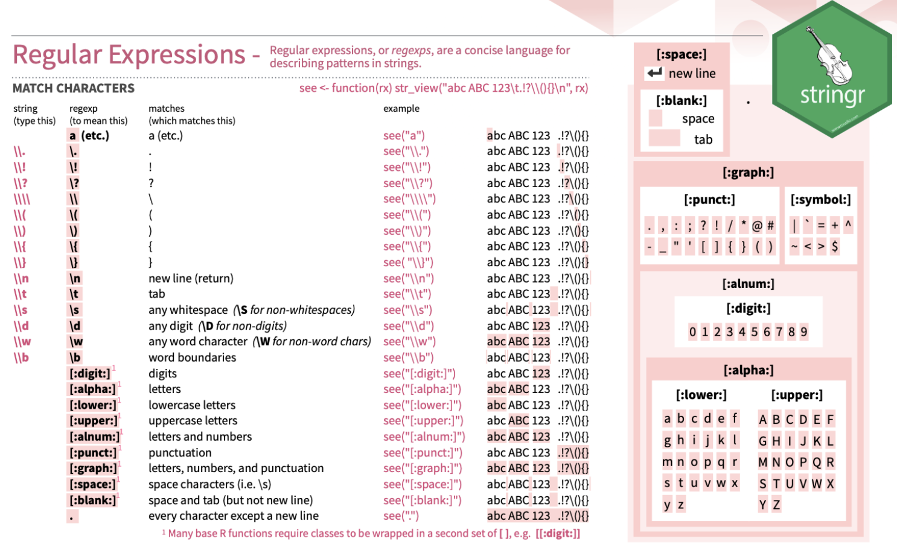

```{r, echo = F, message = F, warning = F}
knitr::opts_chunk$set(fig.width = 4.5, fig.height = 3, warning = F, message = F)

# Load packages 
if(!require(pacman)) install.packages("pacman")
pacman::p_load(rlang, tidyverse, knitr, here, janitor,  reactable, gt, flextable, gtsummary, lubridate, medicaldata)

## functions
source(here::here("global/functions/misc_functions.R"))

## default render
registerS3method("reactable_5_rows", "data.frame", reactable_5_rows)
#knitr::opts_chunk$set(class.source = "tgc-code-block", render = reactable_5_rows)

```

# Introduction to Regular expression Regex in {stringr}

We would now like to delve into a family of functions designed for pattern matching, extraction, and substitution in strings, namely `str_detect`, `str_extract`, and `str_replace`. However, before exploring these functions, it's crucial to understand Regular Expressions (Regex), a powerful tool for pattern matching in strings.

Regular Expressions are sequences of characters forming a search pattern used to identify, match, and manipulate specific parts of strings. 

Let's start with `str_sub`, a basic but powerful function in `{stringr}`, to get a feel for string manipulation, which will serve as a stepping stone to understanding more complex pattern matching with Regex.

### Using `str_sub` for String Subsetting

The `str_sub` function in `{stringr}` is used for extracting or replacing substrings within a string. It's a straightforward yet effective tool for accessing specific parts of strings.

#### Basic Usage

The basic usage of `str_sub` involves specifying the string, the start position, and the end position of the substring you want to extract:

```r
library(stringr)

str_sub("Hello World", 1, 5) # Extracts "Hello"
```

This code snippet extracts the first five characters from "Hello World".

#### Negative Indices

`str_sub` also allows the use of negative indices. Negative values are counted backward from the end of the string, making it easy to extract substrings from the end:

```r
str_sub("Hello World", -5, -1) # Extracts "World"
```

This example extracts the last five characters of the string.

#### Flexibility without Regex

Even without Regex, `str_sub` can be quite flexible. For instance, you can replace a specific portion of a string:

```r
example_string <- "Hello World"
str_sub(example_string, 1, 5) <- "Goodbye"
example_string # Now it's "Goodbye World"
```

This code changes the first five characters of "Hello World" to "Goodbye".

#### Using `str_sub` with Regex

While `str_sub` doesn't inherently use Regex for its basic operations, understanding how to extract or replace parts of a string is foundational for more advanced pattern matching with Regex, which will be explored in functions like `str_detect`, `str_extract`, and `str_replace`.

In the next sections, we will explore how these functions use Regex to enable powerful and complex string manipulations, building on the understanding developed through `str_sub`.


# Pattern Matching & Substitution: str_detect, str_sub, str_extract, str_replace

Next...

But first: Brief Look at Regular Expressions

Regular expressions, commonly referred to as "regex", are sequences of characters that define search patterns. Think of them as wildcards! When working with strings, these patterns help in recognizing complex sequences, be it specific words, numbers, or a mix of characters in a particular order.

With regex, you can define what you're looking for, making tasks like data extraction and string cleaning more straightforward.

For more information about regex, you can refer to cheatsheets for a quick overview. A handy one for `stringr` with a dedicated section for regex can be found [here](https://github.com/rstudio/cheatsheets/blob/main/strings.pdf).



### Detecting Patterns with `str_detect()`

The `str_detect()` function checks if a string contains a specified pattern. It's best used when you want to filter or categorize data based on the presence of a substring or pattern.

This operation can also be paired with functions like `case_when()` from the `dplyr` package to create new variables or modify existing ones based on whether a pattern is detected.

Suppose that we want to create a new variable based on whether the start date is in a typical format:

```{r}
irs %>%
  mutate(is_typical_format = case_when(
    str_detect(start_date_typical, "\\d{2}/\\d{2}/\\d{4}") ~ TRUE, TRUE ~ FALSE))
```

The syntax is:

-   The string input

-   The pattern to look for

-   If set to TRUE, the `negate` argument returns non-matches elements.

### Creating Subsets of Strings with `str_sub()` and `str_extract`

Sometimes you might want to grab a particular segment of a string, like the year from a date.

`str_sub()` is used to extract or replace substrings from a string! This function allows you to define the start and end positions to slice the string.

Let see a practical example by extracting the first 4 characters from start_date_default. In this case, it would be the year:

```{r}
irs$start_year <- str_sub(irs$start_date_default, start = 1, end = 4)
```

Syntax:

-   The string input.

-   `start` and `end` defines the range of characters

::: side-note
Use `str_sub()` when you have a consistent structure across your strings and you know the exact positions you want to extract!
:::

::: r-practice
### Q: Detecting Patterns {.unlisted .unnumbered}

Which rows in the irs dataframe have a start_date_typical in the standard "DD/MM/YYYY" format?

### Q: Extracting Substrings {.unlisted .unnumbered}

Extract the day (first two digits) from the start_date_typical column.
:::

------------------------------------------------------------------------

The `str_extract()` function is versatile in that it extracts matched patterns from a string using regex! It's useful for cases where the string structure isn't consistent.

For example, if we wanted to extract months from the `start_date_long` variable, we can apply the following syntax:

```{r}
# Example: Extracting the month name from the start_date_long
irs$month_name <- str_extract(irs$start_date_long, "[A-Z][a-z]+", group = F)
```

Syntax:

-   The string input

-   The pattern to look for

    -   Here, the pattern **`"[A-Z][a-z]+"`** looks for a capital letter followed by one or more lowercase letters, capturing month names effectively.

-   The `group` argument specifies whether to return a list of character vector or matrix. - FALSE (default) - returns a list - TRUE - returns a matrix

### Replacing Strings with `str_replace()`

The `str_replace()` function replaces the first instance of a matched pattern in a string.

To illustrate, let's transform the hyphens in `start_date_default` to slashes:

```{r}
irs$start_date_default <- str_replace_all(irs$start_date_default, "-", "/")
```

Syntax:

-   The string input

-   The pattern to look for

-   The replacement value

::: r-practice
### Q: Diving into Regex with str_extract() {.unlisted .unnumbered}

From the start_date_long column, extract the day of the month, which should be two digits following a space after the month name.

### Q: Replacing Patterns with str_replace() {.unlisted .unnumbered}

For the start_date_messy column, suppose some dates use dots (.) instead of slashes (/). Replace all dots with slashes in this column.
:::

------------------------------------------------------------------------
