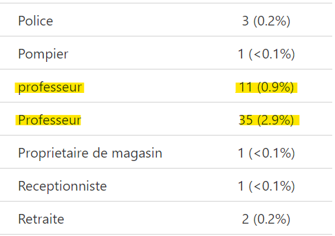

```{r, echo = F, message = F, warning = F}
# Load packages 
if(!require(pacman)) install.packages("pacman")
pacman::p_load(rlang, tidyverse, knitr, here, reactable, gt, flextable)

## functions
source(here::here("global/functions/misc_functions.R"))

## default render
registerS3method("reactable_5_rows", "data.frame", reactable_5_rows)
knitr::opts_chunk$set(class.source = "tgc-code-block")
```

------------------------------------------------------------------------

# Introduction

Le nettoyage des données est le processus qui consiste à transformer des données brutes et "désordonnées" en des données fiables pouvant être analysées correctement. Cela implique d'identifier les points de données **inexacts**, **incomplets** ou **improbables** et de résoudre les incohérences ou les erreurs dans les données, ainsi que de renommer les noms de variables pour les rendre plus clairs et simples à manipuler.

Les tâches de nettoyage de données peuvent souvent être fastidieuses. Une blague courante chez les analystes de données dit : "80% de la science des données consiste à nettoyer les données et les 20% restants à se plaindre du nettoyage des données". Mais le nettoyage des données est une étape essentielle du processus d'analyse des données. Un peu de nettoyage avant de commencer votre analyse contribuera à améliorer la qualité de vos analyses et la facilité avec laquelle ces analyses peuvent être effectuées. Et une gamme de packages et de fonctions dans R peuvent enormoement simplifier le processus de nettoyage des données.

Dans cette leçon, nous allons commencer à examiner un processus de nettoyage de données typique dans R. Les étapes de nettoyage couvertes ici ne correspondent probablement pas exactement à ce dont vous aurez besoin pour vos propres données, mais elles constituent certainement un bon point de départ.

Commençons !

------------------------------------------------------------------------

# Objectifs d'apprentissage

-   Vous pouvez énumérer les opérations typiques impliquées dans le processus de nettoyage des données

-   Vous pouvez diagnostiquer des problèmes dans vos jeux de données à l'aide des fonctions suivantes :

    -   `visdat::vis_dat()`

    -   `skimr::skim()`

    -   `inspectdf::inspect_cat()`

    -   `inspectdf::inspect_num()`

    -   `gtsummary::tbl_summary()`

    -   `DataExplorer::create_report()`

------------------------------------------------------------------------

# Packages

Les packages chargés ci-dessous seront nécessaires pour cette leçon :

```{r}
if(!require("pacman")) install.packages("pacman")
pacman::p_load(visdat,  
               skimr,
               inspectdf,
               gtsummary,
               DataExplorer,
               tidyverse)
```

------------------------------------------------------------------------

# Jeu de données

Le jeu de données principal que nous utiliserons dans cette leçon provient d'une étude menée dans trois centres de santé de Zambezia, au Mozambique. L'étude a examiné les facteurs individuels associés au temps jusqu'à la non-adhérénce aux services de soins et de traitement du VIH. Pour les besoins de cette leçon, nous ne regarderons qu'un sous-ensemble modifié de l'ensemble de données complet.

L'ensemble de données complet peut être trouvé [ici](https://zenodo.org/records/4965547), et l'article peut être consulté [ici](https://www.ncbi.nlm.nih.gov/pmc/articles/PMC6433271/).

Jetons un coup d'œil à ce jeu de données :

```{r message=FALSE}
non_adherence <- read_csv(here("data/non_adherence_VF.csv"))
```

```{r render = reactable_5_rows}
non_adherence
```

La première étape du nettoyage des données consistera à explorer cet ensemble de données afin d'identifier les problèmes potentiels qui nécessitent un nettoyage. Cette étape préliminaire est parfois appelée "analyse exploratoire des données" ou AED.

Regardons quelques fonctions simples dans R qui vous aideront à identifier les erreurs et incohérences de données possibles.

------------------------------------------------------------------------

# Visualisation des données manquantes avec `visdat::vis_dat()`

La fonction `vis_dat()` du package `visdat` est un excellent moyen de visualiser rapidement les types de données et les valeurs manquantes dans un jeu de données. Elle crée un graphique qui montre une vue "zoomée" de votre dataframe : chaque ligne du dataframe est représentée par une seule ligne sur le graphique.

Essayons d'abord avec un petit jeu de données fictif pour comprendre son fonctionnement. Copiez le code suivant pour créer un dataframe de 8 patients et leurs informations de diagnostic et de guérison du COVID-19. Comme vous pouvez le voir ci-dessous, certaines informations sont manquantes pour certains patients, représentées par `NA`.

```{r render=reactable_10_rows}
covid_pat <- tribble(
  ~Patient_ID, ~Age, ~Sexe,   ~Souche_Covid, ~Exposition,   ~Jours_guérison,
  1,           25,   "Homme", "Alpha",        NA,           10,
  2,           32,   "Femme", "Delta",        "Hôpital",    15, 
  3,           45,   "Homme", "Beta",         "Voyage",      7,
  4,           19,   "Femme", "Omicron",      NA,           21,
  5,           38,   "Homme", "Alpha",        "Inconnu",    14,
  6,           55,   "Femme", NA,             "Communauté", 19,
  7,           28,   "Femme", "Omicron",      NA,            8,
  8,           NA,   "Femme", "Omicron",      "Voyage",     26  
)
covid_pat
```

Maintenant, utilisons la fonction `vis_dat()` sur notre dataframe pour obtenir une représentation visuelle des types de données et des valeurs manquantes.

```{r dpi = 350}
vis_dat(covid_pat)
```

C'est parfait ! Chaque ligne de notre dataframe est représentée par une seule ligne dans le graphique et différentes couleurs sont utilisées pour illustrer les variables caractères (rose) et numériques (bleu), ainsi que les valeurs manquantes (gris). À partir de ce graphique, nous pouvons voir que plusieurs patients de notre jeu de données ont des données manquantes pour la variable `Exposition`.

Regardons maintenant notre jeu de données du monde réel, qui est beaucoup plus grand et désordonné. Les grands jeux de données réels peuvent présenter des structures complexes qui sont difficiles à repérer sans visualisation, donc des fonctions comme `vis_dat()` peuvent être particulièrement utile. Essayons-le maintenant !

```{r dpi = 350}
vis_dat(non_adherence)
```

Génial ! À partir de cette vue, nous pouvons déjà voir certains problèmes :

-   Il semble y avoir une colonne complètement vide (la colonne `NA` qui est entièrement grise)

-   Plusieurs variables ont beaucoup de valeurs manquantes (comme `Education`, `IMC_intiation_ARV` et `CD4_initation_ARV`)

-   Les noms de certaines variables sont peu clairs/non nettoyés (par exemple, `Age a l'initiation du ARV` et `Statut OMS a l'initiation du ARV` ont des espaces dans leurs noms et `Etat...civil` et `regimen.1` ont des caractères spéciaux `.`)

Dans la prochaine leçon, nous essayerons de remédier à ces problèmes pendant le processus de nettoyage des données. Mais pour l'instant, l'objectif est que nous comprenions les fonctions utilisées pour les identifier. Maintenant que nous savons visualiser les données manquantes avec `vis_dat()`, jetons un coup d'œil à un autre package et fonction qui peut nous aider à générer des statistiques sommaires de nos variables !

::: r-practice

**Q : Repérer les problèmes de données avec `vis_dat()`**

L'ensemble de données suivant a été adapté d'une étude qui a examiné les opportunités manquées de dépistage du VIH chez les patients se présentant pour la première fois pour des soins contre le VIH dans un hôpital universitaire suisse. L'ensemble de données complet peut être trouvé [ici](https://zenodo.org/records/5008340).

```{r}
opp_manquees <- read_csv(here("data/opportunites_manquees.csv"))
```

Utilisez la fonction `vis_dat()` pour obtenir une représentation visuelle des données. Quels problèmes potentiels pouvez-vous repérer ?
:::

------------------------------------------------------------------------

# Génération de statistiques sommaires avec `skimr::skim()`

La fonction `skim()` du package `skimr` fournit un résumé de chaque colonne (par classe/type) dans la console. Essayons-la d'abord sur nos données fictives `covid_pat` pour comprendre son fonctionnement. Tout d'abord, pour rappel, voici notre dataframe `covid_pat` :

```{r render=reactable_10_rows}
covid_pat
```

Parfait, essayons maintenant la fonction `skim()` !

```{r}
skimr::skim(covid_pat)
```

Incroyable ! Comme nous pouvons le voir, cette fonction fournit :

-   Un aperçu des lignes et des colonnes du dataframe

-   Le type de données pour chaque variable

-   `n_missing`, le nombre de valeurs manquantes pour chaque variable

-   `complete_rate`, le taux d'exhaustivité pour chaque variable

-   Un ensemble de statistiques sommaires : la moyenne, l'écart-type, et les quartiles pour les variables numériques ; et la fréquence et les proportions pour les variables catégorielles

-   Des histogrammes spark pour les variables numériques

Maintenant, nous pouvons voir pourquoi cela est si utile avec de grands dataframes ! Revenons à notre jeu de données `non_adherence` et exécutons la fonction `skim()` dessus.

```{r render=reactable_5_rows}
non_adherence
```

```{r}
skimr::skim(non_adherence)
```

À partir de cette sortie de données, nous pouvons identifier certains problèmes potentiels :

-   Nous pouvons confirmer que la colonne `NA` est bien complètement vide : elle a un `complete_rate` de 0

-   La distribution de `Age a l'initiation du ARV` est asymétrique

::: r-practice

**Q : Générer des statistiques sommaires avec `skim()`**

Utilisez `skim()` pour obtenir un aperçu détaillé de l'ensemble de données `opp_manquees`.
:::

Super ! Maintenant nous savons comment générer un bref rapport de statistiques sommaires pour nos variables. Dans la prochaine section, nous découvrirons quelques fonctions utiles du package `inspectdf` qui nous permettent de visualiser différentes statistiques sommaires.

------------------------------------------------------------------------

# Visualisation des statistiques sommaires avec le package `inspectdf`

Bien que la fonction `skimr::skim()` vous donne des résumés de variables dans la console, parfois il est préferable d'avoir un résumé de variables sous une forme graphique plus riche. Pour cela, les fonctions `inspectdf::inspect_cat()` et `inspectdf::inspect_num()` peuvent être utilisées.

Si vous exécutez `inspect_cat()` sur un jeu de données, vous obtenez un résumé des variables catégorielles dans un tableau (les informations importantes sont cachées dans la colonne `levels`). Essayons-le d'abord sur le jeu de données `covid_pat`. Pour rappel, voici notre jeu de données :

```{r render=reactable_10_rows}
covid_pat
```

```{r render=reactable_5_rows}
inspect_cat(covid_pat)
```

La magie se produit lorsque vous utilsier la fonction `show_plot()` sur le résultat de `inspect_cat()` :

```{r}
inspect_cat(covid_pat) %>%
  show_plot()
```

C'est parfait ! Vous obtenez une belle figure récapitulative montrant la distribution des variables catégorielles ! Les niveaux de variable sont également étiquetés, s'il y a suffisamment d'espace pour afficher une étiquette.

Maintenant, essayons-le sur notre jeu de données `non_adherence` :

```{r}
inspect_cat(non_adherence) %>%
  show_plot() 
```

À partir de là, vous pouvez observer certains problèmes avec quelques variables catégorielles :

-   Pour le variable `Age_35`, on a deux niveaux. Le niveau `Moins de 35 ans` commence par une majuscule, tandis que `plus de 35 ans` commence par une minuscule. Ca pourrait être un bonn idée de standardiser cela.

-   La variable `sexe` a les niveaux `F` et `Homme`. Cela pourrait également valoir la peine d'être standardisé.

-   Comme nous l'avons vu précédemment, `NA` est complètement vide.

::: r-practice

**Q : Repérer les problèmes de données avec `inspect_cat()`**

Complétez le code suivant pour obtenir un résumé visuel des variables catégorielles dans le jeu de données `opp_manquees`.

```{r, eval=FALSE}
inspect___() %>%
  __________
```

Combien de problèmes de données potentiels pouvez-vous repérer ?
:::

De même, vous pouvez obtenir un graphique de résumé pour les variables numériques du jeu de données avec `inspect_num()`. Essayons cela sur notre jeu de données `non_adherence` :

```{r}
inspect_num(non_adherence) %>%
  show_plot()
```

À partir de ce graphique généré, vous remarqueriez que de nombreuses variables qui devraient être des variables factor sont codées comme numériques. En fait, les seules vraies variables numériques sont `Age a l'initiation du ARV`, `IMC_initiation_ARV`, `CD4_initiation_ARV` et `Nmbr_comprimes_jour`. Nous corrigerons ces problèmes dans la prochaine leçon lorsque nous passerons au nettoyage des données. En attendant, regardons de plus près une autre fonction qui s'avère particulièrement utile pour les variables catégorielles !

::: r-practice

**Q : Types de variables avec `inspect_num()`**

Utilisez `inspect_num` pour créer des histogrammes de vos variables numériques dans le jeu de données `opp_manquees`. Les types de variables numériques sont-ils corrects ?
:::

------------------------------------------------------------------------

# Explorer les variables catégorielles avec `gtsummary::tbl_summary()`

Bien que la fonction `inspect_cat()` soit utile pour un aperçu graphique des variables catégorielles, elle ne fournit pas d'informations sur les fréquences et les pourcentages pour les différents niveaux. Pour cela, `tbl_summary()` du package `gtsummary` est particulièrement utile ! La sortie de données étant particulièrement longue, nous allons regarder la forme tibble et montrer une photo de la partie importante pour notre jeu de données. Vous pouvez explorer les données complètes en codant chez vous.

Essayons-le sur notre jeu de données `non_adherence` :

```{r}
gtsummary::tbl_summary(non_adherence) %>%
  as_tibble() 
```

Super ! Comme nous pouvons le voir, cela nous fournit un résumé des fréquences et des pourcentages pour les variables catégorielles et la médiane et l'IQR pour les variables numériques.

Ci-dessous vous pouvez voir une photo d'une partie de la sortie où nous pouvons remarquer des problèmes supplémentaires dans nos données qui n'étaient pas clairs avec la fonction `inspect_cat()`. Certaines valeurs de notre variable `Occupation` sont en majuscules, tandis que d'autres sont entièrement en minuscules.



Cela signifie que R ne les reconnaît pas comme étant la même valeur, ce qui poserait problème lors de l'analyse. Nous corrigerons ces erreurs dans la prochaine leçon, pour l'instant passons à notre dernière fonction pour l'analyse exploratoire des données !

::: practice

**Q : Repérer les problèmes de données avec `tbl_summary()`**

Utilisez `tbl_summary()` pour produire un résumé de votre jeu de données `opp_manquees`. Pouvez-vous identifier des problèmes de données supplémentaires ?
:::

------------------------------------------------------------------------

# Création de rapports de données avec `DataExplorer::create_report()`

Enfin, la fonction `create_report()` du package `DataExplorer` crée un profil complet d'un dataframe : un fichier HTML avec des statistiques de base et des visualisations de distribution.

Utilisons cette fonction sur notre jeu de donnnées `non_adherence`. Notez que cela peut prendre un certain temps. Si cela prend trop de temps, vous pouvez l'exécuter sur un sous-ensemble du jeu de données plutôt que sur l'ensemble du jeu de données.

```{r eval = FALSE}
create_report(non_adherence)
```

Comme vous pouvez le voir, le rapport est assez complet. Nous ne passerons pas en revue toutes les sorties de ce rapport de données car de nombreuses graphiques sont les mêmes que celles que nous avons vues avec les fonctions précédentes ! Cependant, certain nouveautés incluent :

-   Un graphique QQ pour évaluer la normalité des variables numériques

-   Une analyse de corrélation (lorsqu'il y a suffisamment de lignes complètes)

-   Une analyse en composantes principales (lorsqu'il y a suffisamment de lignes complètes)

N'hésitez pas à explorer la [documentation du package](https://boxuancui.github.io/DataExplorer/index.html) par vous-même.

::: r-practice

**Q : Rapport de données avec `create_report()`**

Créez un rapport de données pour vos données `opp_manquees` en utilisant la fonction `create_report()` !
:::

------------------------------------------------------------------------

# En Résumé

En nous familiarisant avec les données, nous avons pu identifier certains problèmes potentiels qu'il faudra résoudre avant d'utiliser les données dans une analyse.

Et comme vous l'avez vu d'autres développeurs R ont fait le travail difficile pour créer d'incroyables packages pour analyser rapidement les jeux de données et identifier les problèmes.

À partir de la prochaine leçon, nous allons aborder ces problèmes identifiés un par un, en commençant par le problème de noms de variables incohérents et désordonnés.

On se retrouve à la prochaine leçon !

------------------------------------------------------------------------

# Answer Key {.unnumbered}

### Q : Repérer les problèmes de données avec `vis_dat()` {.unlisted .unnumbered}

```{r}
vis_dat(opp_manquees)
```

-   La colonne NaN est complètement vide

### Q : Générer des statistiques sommaires avec `skim()` {.unlisted .unnumbered}

```{r}
skim(opp_manquees)
```

### Q : Repérer les problèmes de données avec `inspect_cat()` {.unlisted .unnumbered}

```{r}
inspect_cat(opp_manquees) %>%
  show_plot()
```

-   La variable `acute` a 2 niveaux : `Not acute` et `yes`. Cela devrait être normalisé.
-   La variable `sex` a 3 niveaux : `Female`, `Male` et `M`. Le `M` devrait être changé en `Male`.

### Q : Types de variables avec `inspect_num()` {.unlisted .unnumbered}

```{r}
inspect_num(opp_manquees) %>%
  show_plot()
```

-   La variable `cd4category` devrait être une variable de type facteur.

### Q : Repérer les problèmes de données avec `tbl_summary()` {.unlisted .unnumbered}

```{r}
tbl_summary(opp_manquees)
```

-   Pour la variable `reasonsdx`, il y a les catégories `Epidemiological risk` et `Epi risk` qui devraient être regroupées en une seule catégorie.

### Q : Rapport de données avec `create_report()` {.unlisted .unnumbered}

```{r eval=FALSE}
DataExplorer::create_report(opp_manquees)
```

------------------------------------------------------------------------

## References {.unlisted .unnumbered}

Une partie du matériel de cette leçon a été adaptée des sources suivantes :

-   Batra, Neale, et al. The Epidemiologist R Handbook. 2021.*Cleaning data and core functions*. <https://epirhandbook.com/en/cleaning-data-and-core-functions.html#cleaning-data-and-core-functions>

-   Waring E, Quinn M, McNamara A, Arino de la Rubia E, Zhu H, Ellis S (2022). skimr: Compact and Flexible Summaries of Data. <https://docs.ropensci.org/skimr/> (website), <https://github.com/ropensci/skimr/.>

------------------------------------------------------------------------

# Contributeurs {.unlisted .unnumbered}

Les membres suivants de l'équipe ont contribué à cette leçon :

`r tgc_contributors_list(ids = c("amckinley", "kendavidn", "lolovanco", "elmanuko"))` 


