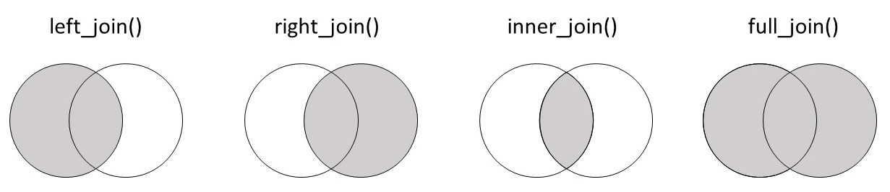

```{r, echo = F, message = F, warning = F}
# Charger les packages 
if(!require(pacman)) install.packages("pacman")
pacman::p_load(rlang, tidyverse, knitr, here, reactable, gt, flextable)

## fonctions
source(here::here("global/functions/misc_functions.R"))

## rendu par défaut
knitr::opts_chunk$set(class.source = "tgc-code-block", render = reactable_5_rows)

```

# Introduction

La jointure de jeux de données est une compétence cruciale lorsqu'on travaille avec des données de santé car elle vous permet de combiner des données provenant de plusieurs sources, conduisant à des analyses plus complètes et perspicaces. Dans cette leçon, vous allez apprendre comment utiliser différentes techniques de jointure en utilisant le package `dplyr` de R. Commençons!

# Objectifs d'Apprentissage

‣ Vous comprenez comment fonctionnent les différentes jointures `dplyr` : left, right, inner et full.

‣ Vous êtes capable de choisir la jointure appropriée pour vos données

‣ Vous pouvez joindre de simples jeux de données ensemble en utilisant des fonctions de `dplyr`

## Packages

‣ Merci de **charger les packages** nécessaires pour cette leçon

```{r}
# Charger les packages
if(!require(pacman)) install.packages("pacman")
pacman::p_load(tidyverse, countrycode)
```

## Qu'est-ce qu'une jointure et pourquoi en avons-nous besoin?

‣ Pour illustrer **l'utilité des jointures**, commençons par un exemple jouet.

‣ Considérez les deux jeux de données suivants : `demographic` et `test_info`

‣ `demographic` : Contient les noms et les âges de trois patients

```{r eval = FALSE}
_______________ <- 
  tribble(~name,     ~age,
          "Alice",    25,
          "Bob",      32,
          "Charlie",  45)

```

‣ `test_info` : Contient les dates et les résultats des tests de tuberculose pour ces patients

```{r eval = FALSE}
________________ <- 
  tribble(~name,     ~test_date,    ~result,
          "Alice",   "2023-06-05",  "Négatif",
          "Bob",     "2023-08-10",  "Positif",
          "Charlie", "2023-07-15",  "Négatif")

```

‣ Nous aimerions **analyser ces données ensemble**, donc nous devons les combiner.

‣ Une option : fonction `cbind()` de base sur R

```{r eval = FALSE}
# Utilisez la fonction cbind
___________(demographic, to)
```

‣ Problème : **La colonne 'name' apparaît deux fois**

‣ Que faire si les lignes des deux jeux de données **ne sont pas déjà alignées**?

‣ Par exemple : `test_info_disordered`

```{r eval = FALSE}
test_info_disordered <- 
  tribble(~name,     ~test_date,    ~result,
          "Bob",     "2023-08-10",  "Positif", # Bob en première ligne
          "Alice",   "2023-06-05",  "Négatif",
          "Charlie", "2023-07-15",  "Négatif")

test_info_disordered
cbind(demographic, test_info_disordered)
```

‣ Les données sont combinées incorrectement. Très naïf

‣ Un troisième problème : **Relation un-à-plusieurs**

‣ Exemple : Alice a effectué plusieurs tests de tuberculose

```{r}
test_info_multiple <- 
  tribble(~name,     ~test_date,    ~result,
          "Alice",   "2023-06-05",  "Négatif",
          "Alice",   "2023-06-06",  "Négatif",
          "Bob",     "2023-08-10",  "Positif",
          "Charlie", "2023-07-15",  "Négatif")
 test_info_multiple
```

‣ `cbind()` ne fonctionnerait pas ici en raison d'un décalage dans le nombre de lignes :

```{r eval = F}
cbind(demographic, test_info_multiple)
```

**Vocabulaire**

‣ **Relation un-à-plusieurs** : Une entité dans un jeu de données, plusieurs entités correspondantes dans un autre jeu de données. Nous en tiendrons compte dans une future leçon.

‣ Nous avons besoin d'une méthode plus intelligente pour combiner les jeux de données

## Introduction à `left_join()`

‣ Résout les problèmes rencontrés avec `cbind()`

‣ **Cas simple** : Fonctionne lorsque les jeux de données sont parfaitement appariés.

```{r eval = FALSE}
left_join(_______________ , ______________)
```

‣ Ne duplique pas la colonne name.

‣ **Données désordonnées** : Fonctionne même si les jeux de données ne sont pas dans le même ordre

```{r eval = FALSE}
left_join(demographic, _________________)
```

‣ **Un à plusieurs** : Peut gérer plusieurs entrées pour une seule entité

```{r eval = FALSE}
left_join(demographic, ______________)
```

‣ **Efficacité et clarté** : Simple mais puissant

**Pipe avec `left_join()`**

‣ Utilisation de l'opérateur de pipe `%>%` avec `left_join()`

```{r results = "hide"}
demographic %>% left_join(test_info) # équivalent:
left_join(demographic, test_info)
```

## Syntaxe de jointure

‣ Les jointures opèrent sur deux jeux de données : `x` (le jeu de données *de gauche*) et `y` (le jeu de données *de droite*).

‣ Vous pouvez entrer ces jeux de données soit comme des arguments **nommés**, soit comme des arguments **non nommés** :

```{r eval = FALSE}
# Essayons les deux façons :
left_join(_______________________) # nommé
left_join(_______________________) # non nommé
```

‣ L'argument `by` indique la **clé** pour connecter les tables. Parfois, il n'est pas nécessaire :

```{r eval = F}
# ceux-ci sont équivalents
left_join(x = demographic, y = test_info)  
left_join(x = demographic, y = test_info, ___________)
```

‣ Parfois, il n'est pas nécessaire de fournir `by` ; il peut être **déduit** à partir des colonnes communes.

```{r eval = FALSE}
# Ici, "name" est la colonne commune :
left_join(________________________)  
left_join(________________________)
```

‣ `by` est parfois nécessaire : que faire si les clés sont **nommées différemment** dans les deux jeux de données ?

```{r eval = FALSE}
________________________ <- 
  tribble(~test_recipient,   ~test_date,       ~result, # remplacer `name` par un mot différent
          "Alice",     "2023-06-05",  "Négatif",
          "Bob",       "2023-08-10",  "Positif",
          "Charlie",   "2023-07-15",  "Négatif")


```

‣ Essayer de joindre `test_info_different_name` avec `demographic` conduira à une erreur :

```{r eval = FALSE}
left_join(________________, ____________________)
```

‣ **Pourquoi ? Pas de clé évidente**

‣ Soit **renommer la colonne** soit préciser les colonnes sur lesquelles faire la jointure en utilisant `by = c()`.

```{r eval = FALSE}
left_join(demographic, test_info_diffenrent_name, 
          by = c("name" = "test_recipient") )
```

‣ `c("name" = "test_recipient")` indique à R de connecter `name` du jeu de données x avec `test_recipient` du jeu de données y. ::: practice **Left joint Patients et Consultations**

Considérez les deux jeux de données ci-dessous, l'un avec les détails des patients et l'autre avec les dates de consultation médicale pour ces patients.

```{r}
patients <- tribble(
  ~patient_id, ~name,     ~age,
  1,          "John",      32,
  2,          "Joy",       28,
  3,          "Khan",      40
)

consultations <- tribble(
  ~patient_id, ~consultation_date,
  1,          "2023-01-20",
  2,          "2023-02-20",
  3,          "2023-05-15"
) 
```

Joignez le jeu de données `patients` avec le jeu de données `consultations` en utilisant `left_join()` 
:::

::: practice
**Left join avec l'argument by**

Deux jeux de données sont définis ci-dessous, l'un avec les détails des patients et l'autre avec les enregistrements de vaccination pour ces patients.

```{r}
# Détails des patients
details_patients <- tribble(
  ~id_number,  ~full_name,   ~address,
  "A001",      "Alice",      "123 Elm St",
  "B002",      "Bob",        "456 Maple Dr",
  "C003",      "Charlie",    "789 Oak Blvd"
)

# Enregistrements de vaccination
enregistrements_vaccination <- tribble(
  ~patient_code, ~vaccine_type,  ~vaccination_date,
  "A001",        "COVID-19",     "2022-05-10",
  "B002",        "Flu",          "2023-09-01",
  "C003",        "Hepatitis B",  "2021-12-15"
)
```
:::

Joignez les jeux de données `details_patients` et `enregistrements_vaccination`. Vous devrez utiliser l'argument `by` car les colonnes identifiant les patients ont des noms différents. :::

## Types de jointures

‣ Dans le monde réel, les jeux de données ne correspondent pas parfaitement. On n'aura pas toujours Alice, Bob et Charlie dans les deux jeux de données.

‣ Chaque ligne d'un jeu de données n'a pas nécessairement une ligne correspondante dans l'autre

‣ Différents types de jointures gèrent ces correspondances imparfaites :

`left_join()`, `right_join()`, `inner_join()`, `full_join()`

## `left_join()`

‣ `left_join()` conserve tous les enregistrements du jeu de données de gauche

‣ Même s'il n'y a pas de correspondance dans le jeu de données de droite

‣ Revisitons le jeu de données `demographic` et un jeu de données `test_info` modifié

```{r}
demographic
test_info
```

‣ En supprimant `Charlie`, en ajoutant un nouveau patient `Xavier` au jeu de données `test_info`

```{r eval = FALSE}
# Créer et afficher le jeu de données test_info modifié
________________  <- tribble(
  ~name,    ~test_date, ~result,
  "Alice",  "2023-06-05", "Négatif",
  "Bob",    "2023-08-10", "Positif",
  "Xavier", "2023-05-02", "Négatif")
_________________
```

‣ Maintenant, effectuons un `left_join()`:

```{r eval = FALSE}
# Effectuer un Left joint avec `demographic` comme jeu de données de gauche
left_join(x = __________________, y = __________________)
# Que va-t-il se passer pour Charlie et que va-t-il se passer pour Xvier ?
```

‣ `Charlie` est conservé avec des valeurs `NA` pour les informations de test

‣ `Xavier` est écarté !

‣ Dans `left_join(x = demographic, y = test_info_xavier)`, tous les enregistrements du jeu de données de **gauche** (`demographic`) sont conservés.

‣ Représentation visuelle de comment fonctionne `left_join()`


‣ Que se passe-t-il lorsque nous intervertissons les jeux de données de gauche et de droite ?

```{r render=reactable_5_rows eval = FALSE}
# Effectuer un left join avec test_info_xavier comme jeu de données de gauche
left_join(____________________, _________________ )
```

‣ Maintenant, les données de Xavier sont incluses et celles de Charlie sont exclues. `left_join()` conserve toutes les lignes du jeu de données de gauche, `test_info_xavier`

::: vocab
**Jeu de données principal** : C'est le jeu de données "principal" ou "prioritaire" dans une jointure. Dans un left join, le jeu de données de gauche est le jeu de données principal.
:::

::: practice
**left join Diagnostics et Démographie**

Essayez ce qui suit. Ci-dessous, deux jeux de données - l'un avec des diagnostics de maladies (`disease_dx`) et un autre avec des informations démographiques des patients (`patient_demographics`).

```{r}
disease_dx <- tribble(
  ~patient_id, ~disease,       ~date_of_diagnosis,
  1,            "Grippe",    "2023-01-15",
  4,            "COVID-19",     "2023-03-05",
  8,            "Grippe",    "2023-02-20",
)

patient_demographics <- tribble(
  ~patient_id, ~name,      ~age,  ~gender,
  1,            "Fred",      28,  "Femme",
  2,            "Genevieve", 45,  "Femme",
  3,            "Henry",     32,  "Homme",
  5,            "Irene",     55,  "Femme",
  8,            "Jules",     40,  "Homme"
)
```

Utilisez `left_join()` pour fusionner ces jeux de données, en ne conservant que les patients pour lesquels nous avons des informations démographiques. Réfléchissez bien à quel jeu de données mettre à gauche.
:::

------------------------------------------------------------------------

‣ Dans cet exemple, nous analyserons l'incidence de la tuberculose et les dépenses de santé du gouvernement dans 47 pays africains

‣ **Données sur le taux d'incidence de la tuberculose** pour 100 000 personnes de l'[Organisation mondiale de la santé (OMS)](https://www.who.int/data/gho/data/indicators/indicator-details/GHO/incidence-of-tuberculosis-(per-100-000-population-per-year))

```{r}
tb_2019_africa<- read_csv(here("data/tb_incidence_2019.csv"))
tb_2019_africa
```

‣ **Données sur les dépenses de santé par habitant** des pays du monde entier, également de l'OMS

```{r}
health_exp_2019 <- read_csv(here("data/health_expend_per_cap_2019.csv"))
health_exp_2019
```

‣ Imaginez que vous vouliez voir comment l'incidence de la tuberculose varie avec les dépenses de santé dans les pays africains ? Quel jeu de données devrait être à gauche ?

‣ Utilisez `tb_2019_africa` comme **jeu de données de gauche** dans la jointure pour vous assurer que tous les pays africains sont inclus dans le jeu de données final

```{r eval = FALSE}
___________________ <- 
  _____________________ %>%
  left_join(_______________________)

```

‣ 47 lignes conservées pour les 47 pays africains.

‣ Ensuite, vérifiez si des pays dans `tb_2019_africa` n'ont pas de correspondance dans `health_exp_2019`

```{r}
tb_health_exp_2019 %>% 
  filter(is.na(expend_usd))
```

‣ Maurice, le Soudan du Sud et les Comores n'avaient pas de données sur les dépenses, mais sont toujours dans le jeu de données joint

‣ Confirmez que ces pays sont absents du jeu de données sur les dépenses

```{r}
health_exp_2019 %>% 
  filter(country %in% c("Mauritius", "South Sudan", "Comoros"))
```

‣ Il faudra exclure ces pays de l'analyse.

::: practice
**left join des cas de TB et les continents**

Copiez le code ci-dessous pour définir deux jeux de données.

La première, `tb_cases_children` contient le nombre de cas de tuberculose chez les moins de 15 ans en 2012, par pays :

```{r}
tb_cases_children <- tidyr::who %>%
  filter(year == 2012) %>%
  transmute(country, tb_cases_smear_0_14 = new_sp_m014 + new_sp_f014)

tb_cases_children 
```

Et `country_continents`, du package {countrycode}, liste tous les pays et leurs régions et continents correspondants :

```{r}
country_continents <-
  countrycode::codelist %>%
  select(country.name.fr, continent, region) 

country_continents
```

Votre objectif est d'ajouter les données de continent et de région à l'ensemble de données des cas de tuberculose.

Quel ensemble de données devrait être le dataframe de gauche, `x` ? Et lequel devrait être le dataframe de droite, `y` ? Une fois que vous avez décidé, joignez les ensembles de données de manière appropriée en utilisant `left_join()`.
:::

## `right_join()`

‣ Un `right_join()` est comme une image miroir d'un `left_join()`

‣ Conserve toutes les lignes du jeu de données de **DROITE**

‣ Exemple utilisant les datasets `demographic` et `test_info_xavier`

```{r}
# Rappel des datasets demographic et test_info_xavier
demographic
test_info_xavier
```

‣ Maintenant, utilisons `right_join()` avec `demographic` comme dataframe de droite

```{r eval = FALSE}
right_join(________________, __________________)
```

‣ Toutes les lignes de `demographic` sont conservées (Alice, Bob et Charlie)

‣ Seuls les enregistrements correspondants dans `test_info_xavier` sont conservés

‣ Right join donne la priorité à l'ensemble de données à droite, `demographic`

‣ L'image ci-dessous illustre le processus `right_join()`


‣ Le même jeu de données final peut être créé avec `left_join()` ou `right_join()`

‣ Cela dépend de l'ordre des jeux de données

```{r eval = FALSE}
# En utilisant right_join 

____________ (______________, _______________)

# En utilisant left_join

____________ (______________, _______________)

```

::: side-note
‣ L'ordre des colonnes peut varier entre `left_join()` et `right_join()`

‣ Les colonnes peuvent être réorganisées, donc pas besoin de s'inquiéter de leur ordre
:::

‣ Les data scientists préfèrent généralement `left_join()` à `right_join()`

‣ Une logique plus claire et moins sujette aux erreurs. Le jeu de données primaire (`x`) vient en PREMIER dans la fonction.

‣ Pas de question pratique ici. Ignorez simplement `right_join()`. Lorsque vous en aurez besoin, vous saurez quoi faire.

‣ Passons de `left_join()` et `right_join()`, explorons `inner_join()` et `full_join()`.

## `inner_join()`

‣ `inner_join` conserve les lignes qui sont **communes aux deux** jeux de données

‣ Revenons à notre exemple avec les patients et leurs résultats de test COVID.

```{r}
demographic
test_info_xavier  
```

‣ Réfléchissez à ce que donnerait le résultat en utilisant `inner_join()`.

‣ Seuls `Alice` et `Bob` sont présents dans *les deux* jeux de données.

```{r eval = FALSE}
____________ (______________, _______________)
```

‣ `Charlie` n'était présent que dans `demographic`, `Xavier` n'était présent que dans `test_info_xavier`, ils sont donc supprimés.

‣ L'ordre des jeux de données dans `inner_join()` n'affecte pas le résultat.

```{r eval = FALSE}
____________ (______________, _______________)
```

::: practice
**Inner Join Pathogènes**

Les données suivantes concernent les épidémies alimentaires aux États-Unis en 2019, issues du [CDC](https://wwwn.cdc.gov/FoodNetFast/PathogenSurveillance/AnnualSummary). Copiez le code ci-dessous pour créer deux nouveaux jeux de odnnées :

```{r}
total_inf <- tribble(
  ~pathogène,         ~infections_totales,   
  "Campylobacter",    9751,     
  "Listeria",         136,   
  "Salmonella",       8285,
  "Shigella",         2478,    
)

outcomes <- tribble(
  ~pathogène,        ~n_hosp,    ~n_décès,
  "Listeria",          128,        30,
  "STEC",              582,        11,
  "Campylobacter",     1938,       42,
  "Yersinia",          200,        5,
)
```

Quels pathogènes sont communs aux deux jeux de données ? Utilisez un `inner_join()` pour joindre les jeux de données et ne conserver que les pathogènes présents dans les deux jeux de données.
:::

‣ Revenons maintenant à nos données sur les dépenses de santé et les taux d'incidence de la TB.

```{r}
tb_2019_africa
health_exp_2019
```

‣ Créez un nouveau jeu de données, `inner_exp_tb`, pour ne conserver que les pays présents dans les deux jeux de données.

```{r eval = FALSE}
______________ <- tb_2019_africa %>%
  inner_join(__________________)

```

::: r-practice
**Inner join Une Ligne**

Le code ci-dessous filtre le jeu de données `health_exp_2019` aux 70 pays ayant les dépenses les plus élevées :

```{r}
highest_exp <-
  health_exp_2019 %>%
  arrange(-expend_usd) %>%
  head(70) 
```

Utilisez un `inner_join()` pour joindre ce jeu de données `highest_exp` au jeu de données sur l'incidence de la TB en Afrique, `tb_2019_afrique`.

Si vous procédez correctement, une seule ligne sera retournée. Pourquoi ?
:::

‣ `inner_join()` est une jointure couramment utilisée, mais n'oubliez pas qu'elle peut exclure beaucoup de données.

‣ Nous allons maintenant explorer `full_join()`, la jointure la plus inclusive.

## `full_join()`

‣ `full_join()` conserve tous les enregistrements des deux jeux de données.

‣ Si des associations manquent entre les jeux de données, la fonction remplit avec `NA`.

‣ Démontrons cela avec les jeux de données `demographic` et `test_info_xavier`.

```{r}
demographic
test_info_xavier
```

```{r eval = FALSE}
# `full_join` avec `demographic` comme jeu de données principal.
full_join(________________ , ________________)
```

‣ Toutes les lignes sont conservées, aucune information n'est perdue.

‣ L'ordre des jeux de données affecte l'ordre des colonnes, mais pas les informations conservées.

```{r eval = FALSE}
full_join(________________ , ________________)
```

‣ À nouveau, toutes les données sont conservées avec les valeurs manquantes remplies par `NA`.

{width="694"}

**PRATIQUE !**

::: practice
**full join des Données sur le Paludisme**

Les jeux de données suivants contiennent les taux d'incidence du paludisme pour 100 000 habitants et les taux de mortalité dus au paludisme pour 100 000 habitants dans le monde, provenant de [Our World in Data](https://ourworldindata.org/malaria). Copiez le code pour créer deux petits jeux de données :

```{r}
malaria_inc <- tribble(
  ~year, ~inc_100k,
  2010, 69.485344,
  2011, 66.507935,
  2014, 59.831020,
  2016, 58.704540,
  2017, 59.151703,
)
malaria_deaths <- tribble(
  ~year, ~deaths_100k,
  2011, 12.92,
  2013, 11.00,
  2015, 10.11,
  2016, 9.40,
  2019, 8.95
)
```

Puis, joignez les tables ci-dessus en utilisant un `full_join()` afin de conserver toutes les informations des deux jeux de données.
:::

‣ Maintenant, revenons au jeu de données sur la TB et les dépenses de santé.

```{r}
tb_2019_africa 
health_exp_2019
```

‣ Créez un nouveau jeu de données, `full_tb_health`, en utilisant un `full_join`.

```{r eval = FALSE}
full_tb_health <- tb_2019_africa %>%
 full_join(___________________)
full_tb_health
```

‣ Toutes les lignes sont conservées, avec `NA` pour les valeurs manquantes.

‣ Diagrammes de Venn des jointures Gauche, Droite, Interne et Complète:



## Objectifs d'Apprentissage

-   Vous comprenez comment fonctionnent les différentes jointures `dplyr` : gauche, droite, interne et complète.


-   Vous êtes capable de choisir la jointure appropriée pour vos données


-   Vous pouvez joindre des ensembles de données simples ensemble en utilisant des fonctions de `dplyr`
