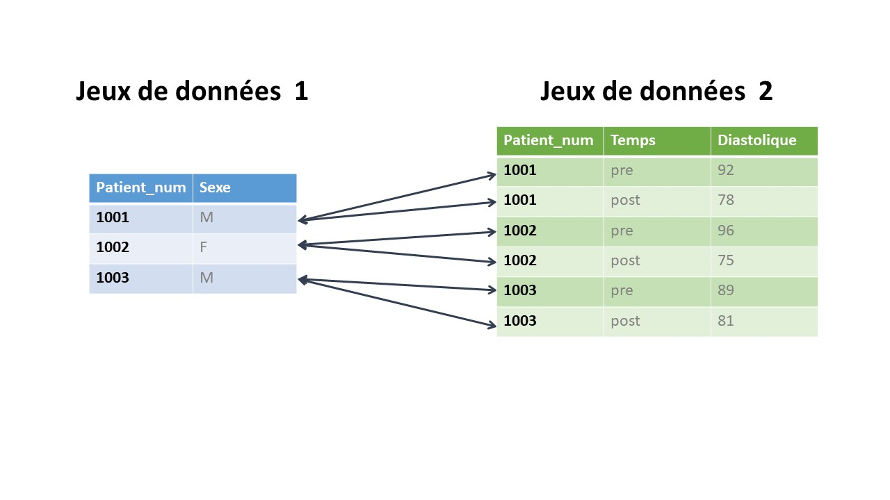

```{r, echo = F, message = F, warning = F}
# Load packages 
if(!require(pacman)) install.packages("pacman")
pacman::p_load(rlang, tidyverse, knitr, here, reactable, gt, flextable)

## functions
source(here::here("global/functions/misc_functions.R"))

## default render
registerS3method("reactable_5_rows", "data.frame", reactable_5_rows)
knitr::opts_chunk$set(class.source = "tgc-code-block")
```

# Introduction

Maintenant que nous maîtrisons bien les différents types de jointures et leur fonctionnement, nous pouvons voir comment gérer des ensembles de données plus complexes et désordonnés. La jointure de données réelles issues de sources différentes nécessite souvent réflexion et nettoyage préalables.

# Objectifs d'apprentissage

-   Vous savez comment vérifier les valeurs discordantes entre des jeux de données

-   Vous comprenez comment effectuer une jointure de type un-à-plusieurs

-   Vous savez comment effectuer une jointure sur plusieurs colonnes clés

# Packages

Veuillez charger les packages nécessaires pour cette leçon avec le code ci-dessous :

```{r warning = F, message = F, echo = T}
if(!require(pacman)) install.packages("pacman")
pacman::p_load(tidyverse)
```

# Nettoyage préalable des données

Il est souvent nécessaire de nettoyer préalablement vos données lorsque vous les extraire de différentes sources avant de pouvoir les joindre. Cela est dû au fait qu'il peut y avoir des différences dans la manière dont les valeurs sont écrits dans les différentes tables, comme des erreurs d'orthographe, des différences de casse, ou des espaces en trop. Pour joindre les valeurs, elles doivent correspondre parfaitement. Si des différences existent, R les considère comme des valeurs distinctes.

Pour illustrer ceci, reprenons nos données fictives de patient du premier cours. Vous vous souvenez probablement que nous avions deux dataframes, un appelé `demographique` et l'autre `info_test`. Nous pouvons recréer ces jeux de données mais changer `Alice` en `alice` dans le dataframe `demographique` tout en gardant les autres valeurs identiques.

```{r render=reactable_5_rows}
demographique <- tribble(
  ~nom,     ~age,
  "alice",    25,
  "Bob",      32, 
  "Charlie",  45,
)
demographique

info_test <- tribble(
  ~nom,       ~date_test,    ~resultat,
  "Alice",    "2023-06-05",  "Negatif",
  "Bob",      "2023-08-10",  "Positif", 
  "Xavier",   "2023-05-02",  "Negatif",
)
info_test
```

Essayons maintenant une jointure interne `inner_join()` sur nos deux jeux de données.

```{r render=reactable_5_rows}
inner_join(demographique, info_test, by="nom")
```

Comme nous pouvons le voir, R n'a pas reconnu `Alice` et `alice` comme étant la même personne, donc la seule valeur commune entre les jeux de données était `Bob`. Comment pouvons-nous gérer cela ? Eh bien, il existe plusieurs fonctions que nous pouvons utiliser pour modifier nos chaînes de caractères. Dans ce cas, utiliser `str_to_title()` fonctionnerait pour s'assurer que toutes les valeurs soient identiques. Si nous appliquons cette fonction à notre colonne `nom` dans notre dataframe `demographique`, nous pourrons joindre correctement les tables.

```{r render=reactable_5_rows}
demographique <- demographique %>%
  mutate(nom = str_to_title(nom))
demographique
inner_join(demographique, info_test, by="nom")
```

Cela a parfaitement fonctionné ! Nous ne rentrerons pas dans les détails de toutes les différentes fonctions que nous pouvons utiliser pour modifier les chaînes de caractères, puisqu'elles sont couvertes de manière exhaustive dans la leçon sur les chaînes de caractères. L'élément important de cette leçon est que nous allons apprendre à identifier les valeurs discordantes entre nos dataframes.

::: r-practice
Les deux jeux de données suivants contiennent des données pour l'Inde, l'Indonésie et les Philippines. Quelles sont les différences entre les valeurs dans les colonnes clés qui devraient être modifiées avant de joindre les jeux de données ?

```{r}
df1 <- tribble(
  ~Pays,         ~Capitale,
  "Inde",        "New Delhi",
  "Indonésie",   "Jakarta",
  "Philippines", "Manille"
)

df2 <- tribble(
  ~Pays,     ~Population,    ~Esperance_de_vie,
  "Inde ",      1393000000,   69.7,
  "indonésie",   273500000,   71.7,
  "Philipines",  113000000,   72.7
)
```
:::

Dans de petits jeux de données comme nos données fictives ci-dessus, il est assez facile de repérer les différences entre les valeurs dans nos colonnes clés. Mais qu'en est-il quand on a un plus grand jeux de données ? Illustrons cela avec deux jeux de données réels sur la tuberculose en Inde.

Notre premier jeu de données contient des données sur la notification des cas de tuberculose en 2022 pour tous les états et territoires de l'Union indienne, issues du [Rapport gouvernemental sur la tuberculose en Inde](https://data.gov.in/catalog/india-tuberculosis-report-2023). Nos variables comprennent le nom de l'état/territoire de l'Union, le type de système de santé dans lequel les patients ont été détectés (public ou privé), le nombre cible de patients dont le statut de tuberculose devait être notifié, et le nombre réel de patients atteints de tuberculose dont le statut a été notifié.

```{r message=FALSE}
notification <- read_csv(here("data/notification_TB_Inde.csv"))
```

```{r render = reactable_5_rows}
notification
```

Notre second jeu de données, également issu du même [Rapport sur la tuberculose](https://data.gov.in/catalog/india-tuberculosis-report-2023), contient le nom de l'état/territoire de l'Union, le type de système de santé, le nombre de patients atteints de tuberculose dépistés pour le COVID-19, et le nombre de patients atteints de tuberculose diagnostiqués positifs au COVID-19.

```{r message=FALSE}
covid <- read_csv(here("data/COVID_TB_Inde.csv"))  
```

```{r render = reactable_5_rows}
covid
```

Pour les besoins de cette leçon, nous avons modifié certains des noms d'états/territoires de l'Union dans le jeu de données `covid`. Notre objectif est de les faire correspondre aux noms du jeu de données `notification` afin de pouvoir les joindre. Pour cela, nous devons comparer les valeurs entre eux. Pour de grands jeux de données, si nous souhaitons comparer quelles valeurs sont présentes dans l'un mais pas dans l'autre, nous pouvons utiliser la fonction `setdiff()` en précisant quels dataframes et colonnes nous souhaitons comparer. Commençons par comparer les valeurs de la colonne `state_UT` du dataframe `notification` à celles de la colonne `state_UT` du dataframe `covid`.

```{r}
setdiff(notification$Etat, covid$Etat)
```

Que nous indique cette liste ? En plaçant le jeu de données `notification` en premier, nous demandons à R "quelles valeurs sont présentes dans `notification` mais PAS dans `covid` ?". Nous pouvons (et devrions!) également inverser l'ordre des jeux de données pour vérifier dans l'autre sens, en demandant "quelles valeurs sont présentes dans `covid` mais PAS dans `notification` ?" Faisons cela et comparons les deux listes.

```{r}
setdiff(covid$Etat, notification$Etat)
```

Comme nous pouvons le voir, il y a quatre valeurs dans le jeu de données `covid` qui présentent des erreurs d'orthographe ou qui sont écrites de manière différente comparer au jeu de données `notification`. Dans ce cas, la solution la plus simple serait de nettoyer les données de `covid` en utilisant la fonction `case_when()` afin de faire correspondre les deux jeux de données. Nettoyons cela et comparons nos jeux de données à nouveau.

```{r}
covid <- covid %>%
  mutate(Etat =
           case_when(Etat == "ArunachalPradesh" ~ "Arunachal Pradesh",
                     Etat == "tamil nadu" ~ "Tamil Nadu",
                     Etat == "Tri pura" ~ "Tripura",
                     Etat == "Dadra & Nagar Haveli & Daman & Diu" ~ "Dadra et Nagar Haveli et Daman et Diu",
                     TRUE ~ Etat))

setdiff(notification$Etat, covid$Etat)
setdiff(covid$Etat, notification$Etat)

```

::: reminder
À des fins d'illustration, nous avons réécrit les valeurs d'origine de notre jeu de données `covid`. Cependant, dans la pratique, lorsque vous transformez vos variables, il vaut toujours mieux créer une nouvelle variable propre et supprimer les anciennes si vous ne les utilisez plus !
:::

Super ! Comme nous pouvons le voir, il n'y a plus de différences dans les valeurs entre nos jeux de données. Maintenant que nous nous sommes assurés que nos données sont propres, nous pouvons passer à la jointure ! Puisque nous comprenons les bases de la jointure grâce à notre premier cours, nous pouvons aborder des sujets plus complexes.

::: r-practice
Le jeu de données suivant, également extrait du [Rapport sur la tuberculose](https://data.gov.in/catalog/india-tuberculosis-report-2023), contient des informations sur le nombre de cas de tuberculose pédiatrique et sur le nombre de patients pédiatriques initiés au traitement.

```{r message=FALSE}
enfant <- read_csv(here("data/enfant_TB_Inde.csv"))
```

```{r render = reactable_5_rows}
enfant
```

En utilisant la fonction `set_diff()`, comparez les valeurs de jointure du jeu de données `enfant` avec celles du jeu de données `notification` et apportez les modifications nécessaires au jeu de données `enfant` pour que les valeurs correspondent.
:::

# Relations un-à-plusieurs

Dans le cours précédent, nous nous sommes intéressés aux jointures un-à-un, où une observation dans un jeu de données correspondait à aau maximum une observation dans l'autre jeu de données. Dans une jointure un-à-plusieurs, une observation dans un jeu de données correspond à plusieurs observations dans l'autre jeu de données. L'image ci-dessous illustre ce concept:



Examinons une jointure un-à-plusieurs avec une jointure de type `left_join()`!

## `left_join()`

Pour illustrer une jointure un-à-plusieurs, reprenons nos données de patients et leurs résultats de tests COVID. Imaginons que dans notre jeu de données, `Alice` et `Xavier` se soient fait tester plusieurs fois pour le COVID. Nous pouvons ajouter deux lignes supplémentaires à notre jeu de données `info_test` avec leurs nouvelles informations de test:

```{r render=reactable_5_rows}
info_test_multiples <- tribble(
  ~nom,    ~date_test, ~resultat,
  "Alice",  "2023-06-05", "Negatif",
  "Alice",  "2023-06-10", "Positif",  
  "Bob",    "2023-08-10", "Positif",
  "Xavier", "2023-05-02", "Negatif",
  "Xavier", "2023-05-12", "Negatif",
)
```

Examinons maintenant ce qui se passe lorsque nous utilisons une jointure de type `left_join()`, avec le jeu de données `demographique` à gauche de l'appel:

```{r render=reactable_5_rows}
left_join(demographique, info_test_multiples)
```

Que s'est-il passé ? Eh bien, nous savons qu'`Alice` était présente dans le jeu de données de gauche, sa ligne a donc été conservée. Mais elle apparaissait deux fois dans le jeu de données de droite, donc ses informations démographiques ont été dupliquées dans le jeu de données final. `Xavier` n'était pas dans le jeu de données de gauche, il a donc été supprimé. En résumé, lorsqu'une jointure un-à-plusieurs est effectuée, les données du côté "un" sont dupliquées pour chaque ligne correspondante du côté "plusieurs". L'illustration ci-dessous présente ce processus :


Nous pouvons voir le même résultat lorsque l'ordre des jeux de données est inversé, en plaçant `info_test_multiples` à gauche de l'appel.

```{r render=reactable_5_rows}
left_join(info_test_multiples, demographique)
```

Encore une fois, les données démographiques d'`Alice` ont été dupliquées ! `Xavier` était présent dans le jeu de données de gauche `info_test_multiples` donc ses lignes ont été conservées, mais comme il n'était pas dans le jeu de données `demographique`, les cellules correspondantes sont définies sur `NA`.

::: r-practice

Copiez le code ci-dessous pour créer deux petits dataframes :

```{r}
info_patient <- tribble(
  ~patient_num, ~nom,     ~age,
  1,            "Liam",     32,
  2,            "Manny",    28,
  3,            "Nico",     40
)

maladies <- tribble(
  ~patient_num, ~maladie,
  1,            "Diabète",
  1,            "Hypertension",
  2,            "Asthme",
  3,            "Cholestérol Élevé",
  3,            "Arthrite"
)

```

Si vous utilisez une fonction `left_join()` pour joindre ces ensembles de données, combien de lignes y aura-t-il dans le dataframe final ? Essayez de le déterminer, puis effectuez la jointure pour voir si vous aviez raison !

:::

Appliquons cela à nos jeux de données du monde réel. Le premier jeu de données sur lequel nous allons travailler est le jeu de données `notification`. Pour rappel, voici à quoi il ressemble:

```{r render = reactable_5_rows}
notification
```

Notre second jeu de données contient 32 des 36 états et territoires de l'union indienne, ainsi que leur catégorie de subdivision et le conseil zonal dans lequel ils sont situés.

```{r message=FALSE}
regions <- read_csv(here("data/regions_FR.csv"))
```

```{r render = reactable_5_rows}
regions
```

Tout d'abord, vérifions s'il y a des différences entre les jeux de données:

```{r}
setdiff(notification$Etat, regions$Etat)
setdiff(regions$Etat, notification$Etat)
```

Comme nous pouvons le voir, il y a quatre états dans le jeu de données `notification` qui ne sont pas dans le jeu de données `regions`. Ce ne sont pas des erreurs à corriger, nous n'avons simplement pas l'information complète dans notre jeu de données `regions`. Si nous voulons conserver tous les cas de `notification`, nous devrons le placer en position de gauche pour notre jointure. Essayons cela !

```{r render=reactable_5_rows}
notif_regions <- notification %>%
  left_join(regions)
```

Comme prévu, les données du jeu de données `regions` ont été dupliquées pour chaque valeur correspondante du jeu de données `notification`. Pour les états qui ne sont pas dans le jeu de données `regions`, comme l'`Andhra Pradesh`, les cellules correspondantes sont définies sur `NA`.

Parfait ! Nous savons maintenant comment utiliser une jointure de type `left_join()` lors de la jointure de jeux de données avec une correspondance un-à-plusieurs. Regardons les différences et similitudes avec une jointure interne, `inner_join()`.

::: r-practice
En utilisant un `left_join()`, joindre le jeu de données de tuberculose pédiatrique `enfant` avec le jeu de données `regions` en conservant toutes les valeurs du jeu de données `enfant`.
:::

## `inner_join()`

Lors de l'utilisation d'une jointure interne `inner_join()` avec une relation un-à-plusieurs, les mêmes principes s'appliquent qu'avec un `left_join()`. Pour illustrer cela, regardons à nouveau nos données de patients COVID et leurs informations de test.

```{r render=reactable_5_rows}
demographique  
info_test_multiples
```

Maintenant, voyons ce qui se passe lorsque nous utilisons un `inner_join()` pour joindre ces deux jeux de données.

```{r render=reactable_5_rows}
inner_join(demographique, info_test_multiples)
```

Avec un `inner_join()`, les valeurs communes entre les jeux de données sont conservées et celles du côté "un" sont dupliquées pour chaque ligne du côté "plusieurs". Puisqu'`Alice` et `Bob` sont communs entre les deux jeux de données, ce sont les seuls à être conservés. Et comme `Alice` apparaît deux fois dans `info_test_multiples`, sa ligne du jeu de données `demographique` est dupliquée !

Essayons cela avec notre jeu de données `covid` sur la tuberculose et notre jeu de données `regions`. Pour rappel, voici nos jeux de données:

```{r render=reactable_5_rows}
covid
regions
```

Comme nous l'avons vu précédemment, le jeu de données `regions` manque 4 états/territoires de l'Union, nous pouvons donc nous attendre à ce qu'ils soient exclus de notre jeu de données final avec un `inner_join()`. Créons un nouveau jeu de données appelé `inner_covid_regions`.

```{r render=reactable_5_rows}
inner_covid_regions <- covid %>%
  inner_join(regions)
inner_covid_regions
```

Parfait, c'est exactement ce que nous voulions !

::: r-practice
Utilisez la fonction `set_diff()` pour comparer les valeurs entre les jeux de données `enfant` et `regions`. Puis, utilisez un `inner_join()` pour joindre les deux jeux de données. Combien d'observations sont conservées ?
:::

# Colonnes clés multiples

Parfois, nous avons plus d'une colonne permettant d'identifier de manière unique les observations que nous souhaitons apparier. Par exemple, imaginons que nous ayons des mesures de pression artérielle systolique et diastolique pour trois patients avant (pre) et après (post) la prise d'un nouveau médicament hypotenseur.

```{r render=reactable_5_rows}
tension_arterielle <- tribble(
  ~nom,    ~temps,  ~systolique,  ~diastolique,  
  "David",  "pre",         139,          87,
  "David",  "post",        121,          82, 
  "Eamon",  "pre",         137,          86,
  "Eamon",  "post",        128,          79,
  "Flavio", "pre",         137,          81, 
  "Flavio", "post",        130,          73
)
tension_arterielle
```

Maintenant, imaginons que nous ayons un autre jeu de données avec les mêmes 3 patients et leurs taux de créatinine avant et après la prise du médicament. La créatinine est un déchet normalement éliminé par les reins. Si les taux de créatinine dans le sang augmentent, cela peut signifier que les reins ne fonctionnent pas correctement, ce qui peut être un effet secondaire des médicaments hypotenseurs.

```{r render=reactable_5_rows}
rein <- tribble(
  ~nom,    ~temps,  ~creatinine,
  "David",  "pre",         0.9, 
  "David",  "post",        1.3,
  "Eamon",  "pre",         0.7,
  "Eamon",  "post",        0.8,
  "Flavio", "pre",         0.6,
  "Flavio", "post",        1.4
)
rein
```

Nous souhaitons joindre les deux jeux de données de sorte que chaque patient ait deux lignes, une ligne pour sa tension artérielle et sa créatininémie avant la prise du médicament, et une ligne pour sa tension artérielle et sa créatininémie après le médicament. Pour cela, notre premier réflexe serait de joindre sur le nom des patients. Essayons et voyons ce qui se passe :

```{r render=reactable_5_rows}
tension_rein_dups <- tension_arterielle %>%
  left_join(rein, by="nom")
tension_rein_dups
```

Comme nous pouvons le voir, ce n'est pas du tout ce que nous voulions ! Nous pouvons joindre sur les noms de patients, mais R affiche un message d'avertissement indiquant qu'il s'agit d'une relation « plusieurs-à-plusieurs » car plusieurs lignes dans un jeu de données correspondent à plusieurs lignes dans l'autre jeu de données, ce qui fait que nous obtenons 4 lignes par patient. En règle générale, vous devriez éviter les jointures plusieurs-à-plusieurs! Notez également que comme nous avons deux colonnes appelées `temps` (une dans chaque jeu de données), ces colonnes sont différenciées dans le nouveau jeu de données par `.x` et `.y`.

Ce que nous voulons faire, c'est apparier à la fois le `nom` et le `temps`. Pour cela, nous devons spécifier à R qu'il y a deux colonnes d'appariement. En réalité, c'est très simple ! Tout ce que nous avons à faire est d'utiliser la fonction `c()` et de préciser les deux noms de colonnes.

```{r render=reactable_5_rows}
tension_rein <- tension_arterielle %>%
  left_join(rein, by = c("nom", "temps"))
tension_rein
```

C'est parfait ! Appliquons cela maintenant à nos jeux de données réels `notification` et `covid`.

```{r render=reactable_5_rows}
notification
covid
```

Réfléchissons à la forme que nous souhaitons voir avoir pour notre jeu de données final. Nous voulons avoir deux lignes par état, une avec les données de notification de la tuberculose et du COVID pour le secteur public, et une pour le secteur privé. Cela signifie que nous devons apparier sur `state_UT` et `hc_type`. Tout comme pour les données de patients, nous devons spécifier les deux valeurs clés dans la clause `by=` en utilisant `c()`. Essayons !

```{r render=reactable_5_rows}
notif_covid <- notification %>%
  left_join(covid, by=c("Etat", "systeme_sante"))  
notif_covid
```

Super, c'est exactement ce que nous voulions !

::: r-practice
Créez un nouveau jeu de données appelé `TB_final` qui rassemble le jeu de données `notif_covid` avec le jeu de données `enfant`. Puis, joignez ce jeu de données avec le jeu de données `regions` pour obtenir un jeu de données combiné final, en vous assurant qu'aucune donnée de tuberculose n'est perdue.
:::

------------------------------------------------------------------------

# Contributors {.unlisted .unnumbered}

The following team members contributed to this lesson:

`r tgc_contributors_list(ids = c("kendavidn"))` (make sure to update the contributor list accordingly!)
