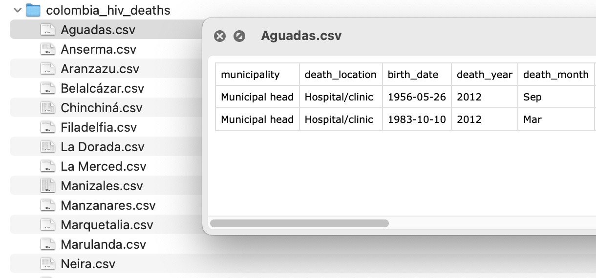
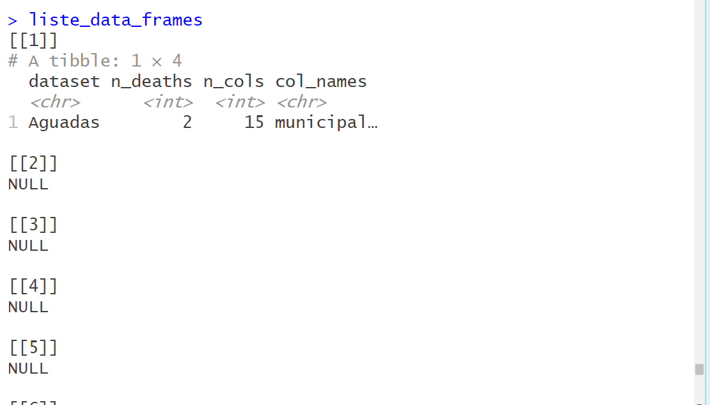
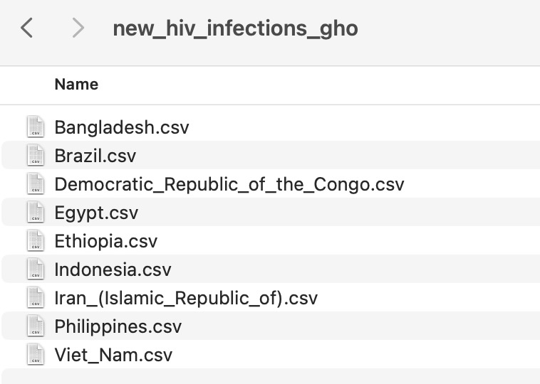

```{r, echo = F, message = F, warning = F}
# Charger les packages
if(!require(pacman)) install.packages("pacman")
pacman::p_load(rlang, tidyverse, knitr, here, reactable, gt, flextable, inspectdf)

## fonctions
source(here::here("global/functions/misc_functions.R"))

## rendu par défaut
registerS3method("reactable_5_rows", "data.frame", reactable_5_rows)
knitr::opts_chunk$set(class.source = "tgc-code-block", error = T)

```

# Introduction

Au cœur de nombreuses tâches de programmation se trouve le concept de répétition d'une tâche plusieurs fois. Une boucle `for` en R nous permet de faire exactement cela. Les boucles permettent une répétition efficace, ce qui fait gagner du temps et des efforts.

Que vous soyez un débutant ou un codeur expérimenté, maîtriser ces concepts est essentiel pour écrire un code R intelligent.

Plongeons-nous et améliorons vos compétences en codage !


# Objectifs d'apprentissage

À la fin de cette leçon, vous serez capable de :

-   Expliquer la syntaxe et la structure d'une boucle `for` de base en R
-   Utiliser des variables d'index pour itérer à travers plusieurs vecteurs simultanément dans une boucle
-   Intégrer des instructions conditionnelles `if/else` dans une boucle
-   Stocker les résultats des boucles dans des vecteurs et des listes
-   Appliquer des boucles à des tâches telles que l'analyse de plusieurs jeux de données et la génération de plusieurs graphiques
-   Déboguer des boucles en isolant et en testant des itérations uniques

## Packages

‣ Nous utiliserons plusieurs packages dans cette leçon

‣ **Assurez-vous que les packages suivants sont installés et chargés :**

```{r}
# Charger les packages nécessaires
if(!require(pacman)) install.packages("pacman")
pacman::p_load(tidyverse, here, openxlsx, tools, outbreaks, medicaldata)
```

## Intro aux boucles `for`

‣ Commençons par un exemple simple d'utilisation des boucles `for` en R

‣ Supposons que nous ayons un **vecteur d'âges d'enfants** et que nous voulions **convertir ceux-ci en mois**

‣ Tout d'abord, créez un vecteur d'âges en années

```{r}
ages <-                         # âges 7 8 et 9
```

‣ Nous pourrions facilement convertir les âges en mois en utilisant l'opération `*` en R

```{r}
______________
```

‣ Ce que R fait (conceptuellement) cependant, c'est exécuter une boucle for. Écrivons-la explicitement

```{r}
________________________________
```

‣ `age` est une variable temporaire qui prend chaque élément dans `ages`

‣ Vous pouvez choisir **n'importe quel nom** pour cette variable

```{r}
for (______________ in ages) print(______________)  # nom_aleatoire
```

‣ Si le contenu de la boucle est **plus d'une ligne**, utilisez des **accolades** `{}`

```{r}
for (age in ages)   # boucle multi-lignes 
  ______________
  ______________
  
```

‣ La structure générale de toute boucle for :

{width="420"}

::: practice
### Boucle Basique pour convertir des Heures en Minutes {.unlisted .unnumbered}

Essayez de convertir des heures en minutes en utilisant une boucle `for`. Commencez avec ce vecteur d'heures :

```{r eval = F}
heures <- c(3, 4, 5) # Vecteur d'heures
# Votre code ici

for ___
  ___ # convertir les heures en minutes et afficher
```
:::

‣ Remarque : Les boucles peuvent être imbriquées les unes dans les autres. Par exemple :

```{r}
# for i in 1:2, for j in 1:2, imprimer i * j
______________
```

‣ Cela crée une combinaison de valeurs `i` et `j` comme le montre ce tableau :

| i   | j   | i \* j |
|-----|-----|--------|
| 1   | 1   | 1      |
| 1   | 2   | 2      |
| 2   | 1   | 2      |
| 2   | 2   | 4      |

‣ Les boucles imbriquées sont cependant moins courantes et ont souvent des alternatives plus efficaces.

:::

# Les boucles `for` sont-elles utiles en R?

‣ R dispose déjà d'opérations *vectorisées* !

‣ Exemple : Conversion d'âge sans boucle. (Ne fonctionne pas par défaut dans la plupart des langages de programmation)

```{r}
# ages * 12

```

‣ De plus, on travaille généralement avec des dataframes et des opérations `tidyverse` :

```{r}
df_ages <- tibble(age = ages)
# muter df_ages pour ajouter la colonne age_mois

```

‣ Les boucles seront très utiles dans des scénarios spécifiques :

-   opérations sur plusieurs dataframes

-   travail avec des objets non-dataframe (par exemple, des tracés)

‣ Nous verrons cela plus tard dans le cours. Pour l'instant, nous nous concentrerons sur des exemples simples, "jouets".

‣ **Boucles vs cartographie de fonction?**

‣ Souvent, les tâches de boucle peuvent être remplacées par des fonctions personnalisées qui sont ensuite mappées sur un vecteur ou un dataframe.

‣ Mais les boucles sont faciles à apprendre, à comprendre et à déboguer, même pour les débutants.

## Boucle avec un Index

‣ Il est souvent utile de parcourir un vecteur en utilisant un index, qui est un compteur pour l'itération en cours.

‣ Exemple : conversion des âges en années en mois en utilisant un index :

```{r}
# Rappel :
ages <- c(7, 8, 9) # Vecteur d'âges
```

‣ Créez une séquence d'indices de la même longueur que le vecteur des âges :

```{r}
    # De 1 à la longueur des ages
    # puis assigner à l'objet appelé indices
```

‣ Utilisez l'index dans une boucle `for` pour convertir chaque âge en mois :

```{r}
# pour i dans indices, imprimer ages[i] * 12

```

‣ Le nom de la variable dans la boucle (par exemple, `i`, `j`, `index`) est arbitraire.

‣ Bien sûr, les boucles basées sur des index peuvent être utilisées directement sans une variable séparée :

```{r}
# pour i de 1 à length(ages), imprimer ages[i] * 12

```

‣ Ces boucles indexées seront utiles pour travailler avec plusieurs vecteurs simultanément.

::: practice
### Boucle Indexée pour convertir des Heures en Minutes {.unlisted .unnumbered}

Réécrivez votre boucle de la dernière question en utilisant des indices :

```{r, eval = F}
heures <- c(3, 4, 5) # Vecteur d'heures

# Votre code ici

for ___ {
  ___
}
```
:::

‣ Remarque : La fonction `seq_along()` est un raccourci pour créer une séquence d'indices.

‣ Équivalent à `1:length()` :

```{r}
# Ces deux sont des façons équivalentesde générer une séquence d'indices pour `ages`


```

# Boucle sur Plusieurs Vecteurs

‣ Faire des boucles avec des indices nous permet de travailler avec plusieurs vecteurs simultanément.

```{r}
# Considérez :
ages <- c(7, 8, 9) # âges en années
tailles <- c(120, 130, 140) # tailles en cm
```

‣ Nous pouvons faire des boucles à travers les deux en utilisant la méthode d'index :

```{r}
# pour i de 1 à length(ages), imprimer une chaîne collée avec l'âge et la taille

for(___________________) {
   
  
  print(paste("Age:", age, "Taille:", taille))
}
```

‣ À chaque itération :

-   `i` est l'index.
-   Nous extrayons le ith élément de chaque vecteur
-   Nous collons les deux ensemble
-   Nous imprimons le résultat

Alternativement, nous pouvons sauter l'assignation de variable et utiliser les indices dans l'instruction `print()` directement :

```{r}
for(i in 1:length(ages)) {
  print(paste("Age:", ages[i], "Taille:", tailles[i]))
}
```

::: practice
### Boucle de Calcul de l'IMC {.unlisted .unnumbered}

En utilisant une boucle `for`, calculez l'Indice de Masse Corporelle (IMC) des trois individus présentés ci-dessous. La formule de l'IMC est `IMC = poids / (taille ^ 2)`.

```{r eval = F}
poids <- c(30, 32, 35) # Poids en kg
tailles <- c(1.2, 1.3, 1.4) # Tailles en mètres

for(i in ____________________) {

  __________________________
  
  print(paste("Poids :", ____,
              "Taille :", ____,
              "IMC :", ____,
              ))
  
}

```
:::

## Stocker les Résultats de la Boucle

‣ Généralement, nous voulons stocker les résultats de la boucle plutôt que simplement les imprimer.

‣ Exemple : conversion des âges en mois.

```{r}
# Souvenez-vous de cette boucle :
ages <- c(7, 8, 9) # Vecteur d'âges
for(i in 1:length(ages)) {
  print(ages[i] * 12)
}
```

‣ Essayons de stocker ces informations dans un vecteur.

‣ Créer un vecteur vide pour stocker les résultats.

```{r}
ages_mois <-  # vecteur de mode "numeric" et de longueur 3

```

‣ Comment stocker des valeurs dans ce vecteur ?

```{r}
                 #Stokez 99 dans le premier élément de ages_mois                   
                 #Stokez 100 dans le premier élément de ages_mois   
```

‣ Maintenant, exécutons la boucle, en stockant les résultats dans `ages_mois` :

```{r}
              # créer un vecteur `age_mois` de mode "numeric" avec la longueur de ages
              # pour i de 1 à length(ages)
              # stocker ages[i] * 12 dans ages_mois[i]
```

::: practice
### Conversion de la Taille de cm en m {.unlisted .unnumbered}

Utilisez une boucle `for` pour convertir les mesures de taille de cm en m. Stockez les résultats dans un vecteur appelé `taille_m`.

```{r eval = F}
taille_cm <- c(180, 170, 190, 160, 150) # Tailles en cm 

taille_m <- vector(_______________) # vecteur numérique de même longueur que taille_cm

for ___ {
  taille_m[i] <- ________________________
}
```
:::

‣ Attention ! Créez votre objet vide **hors** de la boucle pour sauvegarder tous les résultats des itérations.

```{r}
# Considérez ceci :
ages <- c(7, 8, 9)

ages_mois <- vector("numeric", length(ages))
  
for (i in 1:length(ages)) {
  ages_mois[i] <- ages[i] * 12
}
ages_mois 
```

‣ Voyez-vous le problème ?

‣ Note à part. Vous êtes pressé ? Initialisez votre vecteur avec `c()` et ajoutez des valeurs :

```{r}
ages <- c(7, 8, 9)
ages_mois <- c() # moyen rapide et sale d'initialiser un vecteur

for (i in 1:length(ages)) {
  ages_mois <- c(ages_mois, ages[i] * 12)
}
ages_mois


```


‣ Et, vous pouvez ajouter des valeurs à la fin du vecteur en utilisant `c()` :

```{r}
    # Refaire la boucle, mais ajouter des valeurs à la fin du vecteur avec 

```

‣ Déconseillé parce que R ne connaît pas la longueur finale du vecteur, il réalloue donc de la mémoire à chaque fois que vous ajoutez une valeur.

‣ Performances lentes avec de grands vecteurs. Mais pour une analyse rapide, c'est correct.

# Instructions `If` dans les Boucles

‣ Les instructions `If` peuvent être intégrées dans les boucles en R.

‣ Exemple : Classification des âges comme "Enfant" s'ils sont inférieurs à 18 ans.

```{r}
________________ <- c(2, 12, 17, 24, 60) # Vecteur d'âges

# pour age dans age_vec, si age < 18, imprimer "Enfant"


```

‣ Utilisez des accolades pour plus de clarté et pour ajouter plus de code.

```{r}
# mettre ceci dans une boucle:
    print("En cours de traitement:") 
    print(paste("Enfant, Âge", age ))
  
```

‣ Ajoutons une autre condition avec `else if` pour classer 'Enfant' ou 'Adolescent' en fonction de l'âge.

```{r}
# Ajoutez else if age >= 13 && age < 18, imprimez "Adolescent"
for (age in age_vec) {
  if (age < 13) {
    print(paste("Enfant, Âge", age))
  } 
}
```

‣ La dernière déclaration `else` pour d'autres âges, classifiés comme 'Adulte'.

```{r}
# Ajoutez la dernière déclaration else pour "Adulte"
 
```

‣ Nous pouvons stocker ces classifications dans un vecteur en utilisant une boucle basée sur l'index.

```{r}
age_class <-    #vecteur de mode "character" avec longueur de age_vec

for (i in _____________) {
 
}

age_class
```


‣ Utilisez `paste0()` pour combiner la classification avec l'âge.

```{r}
for (i in 1:length(age_vec)) {
  # les instructions if devraient sortir vers la variable "out"
  
  
  
  # puis combinez age_class[i] avec "out" en utilisant paste0()
  age_class[i] <- paste0(out, ", Âge ", age_vec[i])
}
age_class
```

::: pratique
### Classification de la Température {.unlisted .unnumbered}

Vous avez un vecteur de températures corporelles en Celsius. Classez chaque température comme 'Hypothermie', 'Normale', ou 'Fièvre' en utilisant une boucle `for` combinée avec des instructions `if` et `else`.

Utilisez ces règles :

-   En dessous de 36.0°C : 'Hypothermie'
-   Entre 36.0°C et 37.5°C : 'Normale'
-   Au-dessus de 37.5°C : 'Fièvre'

```{r eval = F}
body_temps <- c(35, 36.5, 37, 38, 39.5) # Températures corporelles en Celsius
classif_vec <- vector(______________________) # vecteur de caractères, longueur de body_temps
for (i in 1:length(________)) {
    # Ajoutez votre logique if-else ici
  if (body_temps[i] < 36.0) {
    out <- "Hypothermie" 
  } ## ajoutez d'autres conditions
  
  
    # Déclaration finale d'impression
    classif_vec[i] <- paste(body_temps[i], "°C est", out)
}
classif_vec
```

Un résultat attendu est ci-dessous

```         
35°C est Hypothermie
36.5°C est Normal
37°C est Normal
38°C est Fièvre
39.5°C est Fièvre
```
:::

# Techniques Rapides pour Déboguer les Boucles `for`

‣ **L'édition et le débogage efficaces** sont cruciaux lorsqu'on travaille avec des boucles `for` en R.

‣ Il existe de nombreuses techniques, mais nous en démontrerons deux simples :

‣ **Isoler et exécuter une seule itération** de la boucle.

‣ **Ajouter des instructions `print()`** à la boucle pour suivre les valeurs des variables à chaque itération.

## Isolation et Exécution d'une Seule Itération

‣ Considérez notre boucle désormais familière avec `age_vec` et `age_class` pour la catégorisation des groupes d'âge.

```{r}
age_vec <- c(2, 12, 17, 24, 60) # Vecteur d'âges
age_class <- vector("character", length(age_vec))

for (i in 1:length(age_vec)) {
  if (age_vec[i] < 18) {
    age_class [i] <- "Enfant"
  } else {
     age_class [i] <- "Adulte"
  }
}
age_class
```

‣ **Exemple d'une erreur** dans une boucle en utilisant la colonne `age` du jeu de données `fluH7N9_china_2013`.

```{r eval = F }

flu_dat_age <- outbreaks::fluH7N9_china_2013$age 

# Essayons maintenant de classer les groupes d'âge
age_class <- vector("character", length(flu_dat_age))

for (i in 1:length(flu_dat_age)) {
  if (flu_dat_age [i] < 18) {
    age_class [i] <- "Enfant"
  } else {
     age_class [i] <- "Adulte"
  }
}
```

‣ Vous connaissez peut-être déjà la cause de l'erreur, mais utilisons l'**isolation** pour confirmer.

```{r}
for (i in 1:length(flu_dat_age)) {
  
  # Fixez manuellement i <- 1 et avancez pas à pas, en surlignant et en appuyant sur Ctrl+Enter
  
  if (flu_dat_age [i] < 18) {
    age_class [i] <- "Enfant"
  } else {
     age_class [i] <- "Adulte"
  }
}
```

‣ Si nous exécutons `i <- 1` puis `flu_dat_age[i]`, nous voyons que `flu_dat_age` est un facteur, et non un vecteur numérique.

‣ Pour résoudre ce problème, nous pouvons le convertir en caractère puis en numérique dans la boucle.

‣ Pourquoi ne pas simplement convertir directement en numérique ?

Considérez ceci :

```{r}
flu_dat_age[75]
as.numeric(flu_dat_age[75])
# `?`, qui représente une valeur manquante dans ce cas, est converti en 1, car il s'agit du premier niveau du facteur

# Nous avons donc besoin : 
as.numeric(as.character(flu_dat_age[75]))
```

‣ Essayons maintenant de corriger la boucle, et exécutons à nouveau la première itération :

```{r eval = F}
for (i in 1:length(flu_dat_age)) {
  
  # ▶️ Exécutez à partir de cette ligne 
  i <- 1 # Fixez manuellement i à 1 
  
  age_num <- as.numeric(as.character(flu_dat_age[i]))
  
  # Ensuite, surlignez `age_num < 18` et appuyez sur Ctrl + Entrée

    if (age_num < 18) {
    age_class [i] <- "Enfant"
  } else {
     age_class [i] <- "Adulte"
  }
}
```

‣ La première itération fonctionne maintenant, mais voyons ce qui se passe lorsque nous exécutons la boucle entière :

```{r eval = F}
age_class <- vector("character", length(flu_dat_age))

for (i in 1:length(flu_dat_age)) {
  age_num <- as.numeric(as.character(flu_dat_age[i]))
  
  if (age_num < 18) {
    age_class [i] <- "Enfant"
  } else {
     age_class [i] <- "Adulte"
  }
}
head(age_class)
```

‣ Encore une fois, vous savez peut-être déjà ce que signifie cette erreur, mais disons que vous ne le savez pas.

‣ Nous aurons besoin de notre prochaine technique de débogage.

## Ajout d'Instructions Print à la Boucle

‣ Nous avons vu que la boucle fonctionne bien pour la première itération, mais semble échouer lors d'une itération ultérieure.

‣ Pour détecter à quel moment l'itération échoue, nous pouvons ajouter des instructions `print()` à la boucle :

```{r eval = F}
for (i in 1:length(flu_dat_age)) {
  print (i)
  age_num <- as.numeric(as.character(flu_dat_age[i]))
  print (age_num)
    if (age_num < 18) {
    age_class [i] <- "Enfant"
  } else {
     age_class [i] <- "Adulte"
  }
 print (age_class [i])
}

head(age_class)
```

‣ Maintenant, lorsque nous examinons la sortie, nous pouvons voir que la boucle échoue à la 74e itération :

‣ La 74e valeur de `flu_dat_age` est `NA` (à cause de notre conversion de facteur en numérique)

‣ R ne peut pas évaluer si elle est inférieure à 18.

‣ Nous pouvons corriger cela en ajoutant une instruction `if` pour vérifier les valeurs `NA` :

```{r}
for (i in 1:length(flu_dat_age)) {
  
  age_num <- as.numeric(as.character(flu_dat_age[i]))
  
  if (is.na (age_num)) {
    age_class [i] <- "NA"
  } else if (age_num < 18) {
    age_class [i] <- "Enfant"
  } else {
     age_class [i] <- "Adulte"
  }
}
# Vérifiez la 74e valeur de age_class
age_class[74]
```

‣ Même avec notre boucle "jouet", le débogage peut être un processus qui prend du temps.

‣ Comme votre mère le disait : "La programmation, c'est 98% de débogage et 2% d'écriture de code."

‣ Astuce : R offre des techniques de diagnostic d'erreur avancées comme `try()`, `tryCatch()`, et `browser()`.

‣ Ces techniques ne sont pas couvertes ici mais sont bien documentées dans les ressources R. Cherchez "Hadley Advanced R Debugging" pour plus d'informations.

## Application Réelle des Boucles 1 : Analyse de Plusieurs Jeux de Données

‣ Travail avec plusieurs jeux de données contenant des données sur les décès dus au VIH pour les municipalités en Colombie.

{width="521"}

‣ L'objectif est de compiler une seule table avec des informations sur chaque jeu de données.

‣ **Informations requises** : Nombre de lignes (deaths), nombre de colonnes, et noms des colonnes.

‣ Utilisez une boucle pour éviter l'ennui et les erreurs.

‣ Première étape : Énumérez les fichiers dans le dossier "data/colombia_hiv_deaths".

```{r}
chemins_data_colom <- 
head(chemins_data_colom)
```

‣ Importez un jeu de données que nous utiliserons pour tester notre boucle.

```{r}
____________ <- read_csv(chemins_data_colom [1]) # Importer le premier jeu de données
colum_data
```

‣ Comment recueillir les informations requises de chaque jeu de données.

```{r}
 # Nom du jeu de données/municipalité avec basename() et file_path_sans_ext()
 # Nombre de lignes/décès
 # Nombre de colonnes
 # Noms de toutes les colonnes. Collez les noms() ensemble avec la fonction paste()
```

‣ Stockez les informations en utilisant `tibble` avec les colonnes `dataset`, `n_deaths`, `n_cols`, et `col_names`.

```{r}
ligne_unique <- tibble(___________)
ligne_unique
```

‣ Stockez chaque dataframe dans une liste.

```{r}
liste_data_frames <- vector ("list", length (_____________))
head(liste_data_frames) # Afficher les 6 premiers éléments
                    # Stocker le premier dataframe dans la liste avec [[1]]

```



‣ Rassemblons tout cela :

```{r, message=FALSE}


```

‣ **Vérification de la Liste** : Assurez-vous que la boucle fonctionne correctement.

```{r}
head(liste_data_frames, 2) # Afficher les 2 premiers éléments
```

‣ **Étape finale** : Combine tous les dataframes en un seul jeu de données final.

```{r, message=FALSE}
data_finale_colom <- bind_rows(liste_data_frames)
data_finale_colom
```

::: pratique
### Propriétés des fichiers {.unlisted .unnumbered}

Vous avez un dossier contenant des fichiers CSV avec des données sur les cas de VIH, provenant de [WHO](https://www.who.int/data/gho/data/indicators/indicator-details/GHO/number-of-new-hiv-infections).

{width="373"}

En utilisant les principes appris, vous écrirez une boucle qui extrait les informations suivantes de chaque jeu de données et les stocke dans un seul dataframe :

-   Le nom du jeu de données (c'est-à-dire le pays)
-   La taille du jeu de données en octets
-   La date de dernière modification du jeu de données

Vous pouvez utiliser les fonctions `file.size()` et `file.mtime()` pour obtenir ces deux dernières informations. Par exemple :

```{r}
file.size(here("data/new_hiv_infections_gho/Bangladesh.csv"))
file.mtime(here("data/new_hiv_infections_gho/Bangladesh.csv"))
```

Notez que vous n'avez pas besoin d'importer les CSV pour obtenir ces informations.

```{r eval = F}
# Liste des fichiers
fichiers_csv <- list.files(path = "data/new_hiv_infections_gho", 
                        _____________________________________________)

for (i in _______________) {
  
  chemin <- fichiers_csv[i]
  
  # Obtenez le nom du pays. Indice : utilisez file_path_sans_ext et basename
  nom_pays <- _____________________________________
  
  # Obtenez la taille du fichier et la date de modification
  taille <- _____________________________________________
  date <- _____________________________________________
  
  # Data frame pour cette itération. Indice : utilisez tibble() pour combiner les objets ci-dessus
  ligne_hiv_dat <- _____________________________________________
    
  # Stockez dans la liste. Indice : utilisez des doubles crochets et l'index i
  liste_data_frames_____ <- ligne_hiv_dat
}

# Combine en un seul data frame
info_fichier_final_hiv <- bind_rows(liste_data_frames)
```
:::

::: pratique
### Boucle de Filtrage des Données {.unlisted .unnumbered}

Vous travaillerez à nouveau avec le dossier de jeu de données sur le VIH de la question précédente. Voici un exemple de l'un des jeux de données par pays de ce dossier :

```{r message=FALSE}
données_bangla <- read_csv(here("data/new_hiv_infections_gho/Bangladesh.csv"))
données_bangla
```

Votre tâche est de compléter le modèle de boucle ci-dessous de manière à ce qu'il : - Importe chaque CSV du dossier - Filtre les données au sexe "Female" - Enregistre chaque jeu de données filtré en tant que CSV dans votre dossier `outputs`

Notez que dans ce cas, vous n'avez pas besoin de stocker les sorties dans une liste, car vous importez, modifiez puis exportez directement chaque jeu de données.

```{r eval = F}
# Liste des fichiers
fichiers_csv <- list.files(path = "data/new_hiv_infections_gho", 
                        pattern = "*.csv", full.names = TRUE) 

for (fichier in _____________) {

  # Importer les données. Indice : utilisez read_csv avec la variable `file` comme chemin
  données_hiv _____________________________________________ 
  
  # Filtre. Indice : utilisez filter() et la variable `Sex`
  données_hiv_filtrées <- _____________________________________________ 
  
  # Nom du fichier de sortie 
  # Cette ligne est faite pour vous, mais assurez-vous de la comprendre
  nom_fichier_sortie <-  paste0(here(), "outputs/", "Female_", basename(fichier)))
  
  # Exporter. 
  write_csv(données_hiv_filtrées, nom_fichier_sortie) 
}
```
:::

# Application réelle des boucles 2 : Génération de multiples graphiques

‣ Utilisation des boucles pour **générer plusieurs graphiques** pour différents groupes au sein d'un jeu de données.

‣ Exemple avec le jeu de données `strep_tb` du package `medicaldata`.

‣ Objectif : créer des **graphiques d'inspection de catégorie** pour chaque **groupe d'amélioration radiologique à 6 mois** en utilisant `inspectdf::inspect_cat()`.

‣ D'abord, créez un **seul graphique** pour le **premier groupe d'amélioration radiologique**.

```{r}
_______________ <- 
  medicaldata::strep_tb %>%  
                          #Filtrer radiologic_6m sur "6_Considerable_improvement"
                          #inspect_cat
                          # show_plot
```

Vous voulez créer des graphiques similaires pour **chaque groupe d'amélioration radiologique**.

‣ Identifiez toutes les valeurs uniques de `medicaldata::strep_tb$radiologic_6m`

```{r}
niveaux_radiologic_6m <- _______________________
```

‣ Initiez un **objet liste vide** pour stocker les graphiques.

```{r}
liste_graphiques_cat <- _______________________
```

‣ Optionnellement, définissez les noms des éléments de la liste selon les groupes d'amélioration radiologique.

```{r}
names(liste_graphiques_cat) <- niveaux_radiologic_6m
liste_graphiques_cat
```

‣ Assemblons-le

```{r}

for ( _________ in niveaux_radiologic_6m ) {
  
  #créer un graphique pour chaque niveau
  _________ <- 
  medicaldata::strep_tb %>%  
  filter (________________) %>% 
  inspectdf::inspect_cat() %>% 
  inspectdf::show_plot()
  
  # Ajoute à la liste
  liste_graphiques_cat[[____________]] <- ______________
}
```

‣ Accédez à un graphique spécifique en utilisant la **syntaxe à double crochets** ou par numéro.

```{r}
liste_graphiques_cat[[___________________]] # "6_Considerable_improvement"
```

```{r}
liste_graphiques_cat[[1]]
```

‣ Pour afficher tous les graphiques en une fois, appelez la liste entière.

```{r fig.height = 2, fig.show='hold', message=F}
liste_graphiques_cat
```

::: pratique
### Visualisation des cas de tuberculose {.unlisted .unnumbered}

Dans cet exercice, vous utiliserez les données de l'OMS provenant du package `tidyr` pour créer des graphiques en ligne montrant le nombre de nouveaux cas de tuberculose chez les enfants au fil des années dans les pays sud-américains.

D'abord, nous préparerons les données :

```{r}
cas_tb_enfants <- tidyr::who2 %>% 
  transmute(country, year, 
            cas_tb_enfants = sp_m_014 + sp_f_014 + sn_m_014 + sn_f_014) %>% 
  filter(country %in% c("Brazil", "Colombia", "Argentina", 
                        "Uruguay", "Chilie", "Guyana"))  %>% 
  filter(year >= 2006)

cas_tb_enfants
```

Maintenant, remplissez les blancs dans le modèle ci-dessous pour créer un graphique en ligne pour chaque pays en utilisant une boucle `for` :

```{r}
# Obtenir la liste des pays. Astuce : Utilisez unique() sur la colonne pays
pays <- _____________________________________________ 

# Créer une liste pour stocker les graphiques. Astuce : Initialiser une liste vide
graphiques_cas_tb_enfants <- vector("list", ________________)
names(graphiques_cas_tb_enfants) <- pays # Définir les noms des éléments de la liste

# Boucle à travers les pays
for (country in _____________) { 
  
  # Filtrer les données pour chaque pays
  cas_tb_enfants_filtres <- _____________________________________________ 
  
  # Créer le graphique
  graphique_cas_tb_enfants <- _____________________________________________  
  
  # Ajouter à la liste. Astuce : Utilisez des doubles crochets
  graphiques_cas_tb_enfants[[country]] <- graphique_cas_tb_enfants 
}

graphiques_cas_tb_enfants
```
:::


# Conclusion

Dans cette leçon, nous avons exploré les boucles for en R, démontrant leur utilité pour les tâches basiques jusqu'à l'analyse de données complexes impliquant plusieurs jeux de données et la génération de graphiques. Malgré la préférence de R pour les opérations vectorisées, les boucles for sont indispensables dans certaines situations. Espérons que cette leçon vous a fourni les compétences nécessaires pour implémenter avec confiance les boucles for dans divers contextes de traitement de données.


# Solutions

### Boucle de base de conversion d'heures en minutes

```{r}
heures <- c(3, 4, 5) # Vecteur d'heures

for (heure in heures) {
  minutes <- heure * 60
  print(minutes)
}
```

### Boucle indexée de conversion d'heures en minutes

```{r}
heures <- c(3, 4, 5) # Vecteur d'heures

for (i in 1:length(heures)) {
  minutes <- heures[i] * 60
  print(minutes)
}
```

### Boucle de calcul de l'IMC

```{r}
poids <- c(30, 32, 35) # Poids en kg
tailles <- c(1.2, 1.3, 1.4) # Tailles en mètres

for(i in 1:length(poids)) {
  imc <- poids[i] / (tailles[i] ^ 2)
  
  print(paste("Poids:", poids[i],
              "Taille:", tailles[i],
              "IMC:", imc))
}
```

### Conversion de la taille de cm à m

```{r}
taille_cm <- c(180, 170, 190, 160, 150) # Tailles en cm 

taille_m <- vector("numeric", length = length(taille_cm)) 

for (i in 1:length(taille_cm)) {
  taille_m[i] <- taille_cm[i] / 100
}
taille_m
```

### Classification de la température

```{r}
temp_corps <- c(35, 36.5, 37, 38, 39.5) # Températures corporelles en Celsius
vect_classif <- vector("character", length = length(temp_corps)) # vecteur de caractères

for (i in 1:length(temp_corps)) {
    # Ajoutez votre logVoici une traduction du code Rmarkdown en français : 
```

### Classification de la Température

```{r}
temp_corps <- c(35, 36.5, 37, 38, 39.5) # Températures corporelles en Celsius
vec_classif <- vector("character", length = length(temp_corps)) # vecteur de caractères

for (i in 1:length(temp_corps)) {
    # Ajoutez votre logique if-else ici
    if (temp_corps[i] < 36) {
        sorti <- "Hypothermie"
    } else if (temp_corps[i] <= 37.5) {
        sorti <- "Normal"
    } else {
        sorti <- "Fièvre"
    }
  
    # Déclaration d'impression finale
    vec_classif[i] <- paste(temp_corps[i], "°C est", sorti)
}
vec_classif
```

### Propriétés du Fichier

```{r}
# En supposant que le chemin et la structure du fichier sont corrects
fichiers_csv <- list.files(path = "data/new_hiv_infections_gho", 
                        pattern = "\\.csv$", full.names = TRUE)

liste_data_frames <- vector("list", length = length(fichiers_csv))

for (i in 1:length(fichiers_csv)) {
  
  chemin <- fichiers_csv[i]
  nom_pays <- tools::file_path_sans_ext(basename(chemin))
  
  taille <- file.size(chemin)
  date <- file.mtime(chemin)
  
  ligne_hiv_dat <- tibble(pays = nom_pays, taille = taille, date = date)
    
  liste_data_frames[[i]] <- ligne_hiv_dat
}

info_fichier_hiv_final <- bind_rows(liste_data_frames)
info_fichier_hiv_final
```

### Boucle de Filtrage de Données

```{r}
fichiers_csv <- list.files(path = "data/new_hiv_infections_gho", 
                        pattern = "*.csv", full.names = TRUE) 

for (fichier in fichiers_csv) {
  hiv_dat <- read_csv(fichier)
  
  hiv_dat_filtre <- hiv_dat %>% filter(Sex == "Female")
  
  nom_fichier_sortie <- paste0(here(), "/outputs/", "Female_", basename(fichier))
  
  write_csv(hiv_dat_filtre, nom_fichier_sortie) 
}
```

### Visualisation des cas de TB

```{r}
# En supposant que tb_child_cases est un dataframe avec les colonnes nécessaires
pays <- unique(tb_child_cases$pays)

# Créer une liste pour stocker les tracés
plots_cas_tb_enfants <- vector("list", length(pays))
names(plots_cas_tb_enfants) <- pays

# Boucle à travers les pays
for (nom_pays in pays) { 
  
  # Filtrer les données pour chaque pays
  tb_child_cases_filtre <- filter(tb_child_cases, pays == nom_pays)
  
  # Créer le tracé
  plot_cas_tb_enfants <- ggplot(tb_child_cases_filtre, aes(x = annee, y = tb_cas_enfants)) +
    geom_line() +
    ggtitle(paste("Cas de TB chez les enfants -", nom_pays))
  
  # Ajouter à la liste
  plots_cas_tb_enfants[[nom_pays]] <- plot_cas_tb_enfants 
}

plots_cas_tb_enfants[["Uruguay"]]
```

# Contributeurs {.unlisted .unnumbered}

Les membres de l'équipe suivants ont contribué à cette leçon :

`r tgc_contributors_list(ids = c("sabina", "kendavidn", "guy"))` (assurez-vous de mettre à jour la liste des contributeurs en conséquence !)

------------------------------------------------------------------------

# References {.unnumbered .unlisted}

Certains matériaux de cette leçon ont été adaptés des sources suivantes :

-   Barnier, Julien. "Introduction à R et au tidyverse." <https://juba.github.io/tidyverse>

-   Wickham, Hadley; Grolemund, Garrett. "R pour la science des données." <https://r4ds.had.co.nz/>

-   Wickham, Hadley; Grolemund, Garrett. "R pour la science des données (2e)." <https://r4ds.hadley.nz/>
